## Empirical CPU Power Modelling and Estimation in the gem5 Simulator

Basireddy Karunakar Reddy∗, Matthew J. Walker∗, Domenico Balsamo∗, Stephan Diestelhorst†, Bashir M. Al-Hashimi∗ and Geoff V. Merrett∗

∗University of Southampton

Southampton, UK

{krb1g15,mw9g09,db2a12,bmah,gvm}@ecs.soton.ac.uk

†ARM Ltd.

Cambridge, UK

Stephan.Diestelhorst@arm.com

Abstract—Power modelling is important for modern CPUs to inform power management approaches and allow design space exploration. Power simulators, combined with a full-system architectural simulator such as gem5, enable power-performance trade-offs to be investigated early in the design of a system with different configurations (e.g number of cores, cache size, etc.). However, the accuracy of existing power simulators, such as McPAT, is known to be low due to the abstraction and specification errors, and this can lead to incorrect research conclusions. In this paper, we present an accurate power model, built from measured data, integrated into gem5 for estimating the power consumption of a simulated quad-core ARM Cortex-A15. A power modelling methodology based on Performance Monitoring Counters (PMCs) is used to build and evaluate the integrated model in gem5. We first validate this methodology on the real hardware with 60 workloads at nine Dynamic Voltage and Frequency Scaling (DVFS) levels and four core mappings (2,160 samples), showing an average error between estimated and real measured power of less than $6 \%$ . Correlation between gem5 activity statistics and hardware PMCs is investigated to build a gem5 model representing a quad-core ARM Cortex-A15. Experimental validation with 15 workloads at four DVFS levels on real hardware and gem5 has been conducted to understand how the difference between the gem5 simulated activity statistics and the hardware PMCs affects the estimated power consumption.

## I. INTRODUCTION AND MOTIVATION

Power is a primary design concern in modern systems, especially in embedded and mobile devices. This has increased the demand for accurate and stable models to estimate the power consumption in modern System-on-Chips (SoCs) and identify appropriate power-performance trade-offs at the design time. As a consequence, various SoC power estimation tools have been developed, such as McPAT [1], CACTI [2], and Wattch [3], for evaluating various power-related research ideas [4]–[8]. These tools are used to simulate power/energy consumption of CPUs, caches and memory. Typically, an architectural simulator is used to obtain statistics describing the microarchitecture activity of a CPU/SoC, and these are fed into the power simulator along with a description of the simulator’s microarchitecture and physical implementation details.

Power models can be broadly split into two key categories: bottom-up power models, e.g., aforementioned McPAT, CACTI and Wattch, and top-down power models, e.g., performance monitoring counter (PMC)-based models [9]–[12].

The bottom-up power models take a CPU specification (e.g. cache size, number of pipelines) and attempt to estimate the power by first estimating the CPU complexity, number of components and area and then the amount of switching activity required to perform different tasks. Wattch is a framework for architectural-level power simulation. CACTI is a modelling tool for estimating cache and memory access time, cycle time, area, leakage, and dynamic power using device models based on the industry-standard ITRS roadmap. McPAT is an integrated power, area, and timing modelling framework. In particular, McPAT has gained popularity due to its ease-of-use and readiness, as it needs a single configuration file with activity factors to estimate the power consumption [13]. Despite the flexibility offered for design space exploration (DSE), many of these simulation tools are reported to have considerable error [13]–[15], and are often used without full understanding of their limitations, potentially leading to incorrect research conclusions [16].

Top-down power models are built for a specific CPU implementation using measured empirical data. Such power models are built from PMC data and measured power consumption from a CPU/SoC [17], [18]. Many CPUs have PMCs which count certain architectural and microarchitectural events, such as L2 cache misses, an instruction speculatively executed. These events can be used to determine the CPU behaviour and therefore to estimate the CPU power consumption. Regressionbased models using PMCs as inputs have been widely shown to be effective in estimating CPU power [9]–[12]. However, collecting PMCs from hardware is not straightforward and the required hardware platform is often not available to researchers. While top-down approaches, such as the one presented in this work, are not as flexible as bottom-up (they are only valid on the specific CPU they are built on), their accuracy is significantly improved and well understood for that implementation.

Using architectural simulation tools is usually more convenient and more flexible than using real hardware to run experiments. These are used to evaluate the performance of a CPU/SoC (e.g. execution time of a benchmark/workload) and to simulate hardware events (such as the number of L1 instruction cache accesses) to understand performance bottlenecks. They also enable DSE to experiment with dif-

ferent configurations (e.g. number of cores, cache size, etc.). SimpleScalar [19] is a set of tools used for CPU performance analysis and microarchitectural modelling and supports multiple Instruction-Set Architectures (ISAs): Alpha, PISA, ARM, and x86. MARSSx86 [20] is a cycle-accurate full-system simulator based on PTLsim. It supports the $\mathbf { \boldsymbol { x } } 8 6$ ISA only. The gem5 simulator [21] is a modular and flexible simulation platform supporting multiple ISAs (Alpha, ARM, SPARC, x86). It has an active development community with frequent contributions from many institutions, is freely available and is widely used in recent research. Therefore, we consider gem5 for this work and discuss it in more detail in section II.C. Bottom-up approaches (such as McPAT) are used with the gem5 to estimate power consumption. However, many works have already reported significant errors in estimated power compared to power measured from real hardware. Recently, Butko et al. [22] used gem5 and McPAT to simulate the same device used in this work (an ODROID-XU3 board). They find $24 \%$ average error between the measured energy and modelled energy.

To the best knowledge of the author’s, accurate top-down approaches have not been previously integrated into a flexible architectural simulator, such as gem5. In this work, we build a top-down PMC-based power model, that has been validated on hardware, and integrated into the gem5 simulation framework. Here, we consider a high-performance quadcore ARM Cortex-A15 rather than x86-based processors, as energy efficiency is critical to mobile applications. We use our recently developed empirical PMC-based power modelling methodology [17], [23] to create and evaluate the integrated model that uses hardware PMC events that have direct equivalents (activity statistics) readily available in the gem5. We first validate this methodology on the real hardware with a diverse set of workloads at various Dynamic Voltage and Frequency Scaling (DVFS) levels and core mappings with measured power readings. A gem5 model resembling the hardware platform has then been created and used to evaluate the integrated power model, which takes activity statistics collected from gem5 as input.

The key contributions of this paper are:

- An investigation into correlation between gem5 activity statistics and hardware PMCs, and building of gem5 model resembling quad-core ARM Cortex-A15 cluster on Odroid-XU3;

- Implementation of this model into gem5 and evaluation of accuracy.

We present our proposed methodology including empirical PMC-based power modelling, experimental setup, and empirical power model built on hardware in Section II. It also describes the modelling of quad-core ARM Cortex-A15 in gem5, evaluation of difference between the gem5 power model and real hardware, and implementation of the power model into gem5. Section III explains the experimental results and finally, Section IV concludes the paper.

## II. EMPIRICAL POWER MODEL

To implement the empirical power model into gem5, we first ran 60 workloads on the hardware platform at all available

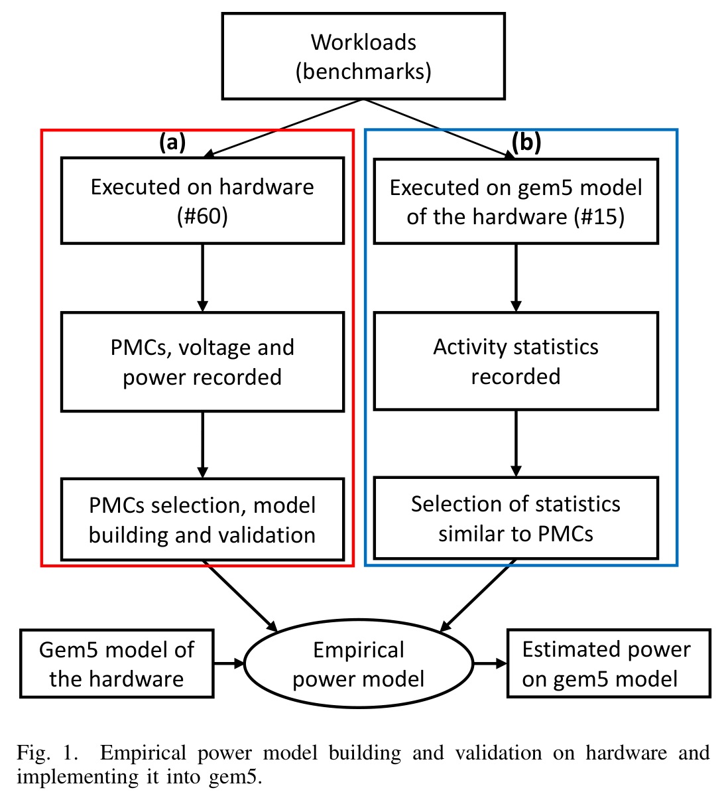

DVFS levels while capturing PMCs, voltage and power, as show in Fig. 1 (a). The hardware platform and workloads are further discussed in section II.A. We then used a model building methodology [17] to choose optimal PMC events for power estimation, and to create accurate and stable power models, which is further explained in section II.B. Following this, we created an architectural model in the gem5 simulation that resembles the hardware platform and ran 15 workloads (subset of 60) on it while recording the resulting activity statistics, as shown in Fig. 1 (b). We analysed the activity statistics and identified ones that corresponded to the chosen hardware PMC events to built the empirical power model considering gem5 requirements (section II.C). We then implemented the empirical power model into the gem5 simulator using the selected activity statistics, as detailed in section II.D. Finally, we evaluated our empirical power model, built considering gem5 requirements (readily available activity statistics), on the real hardware in section III. In order to directly test and demonstrate the power model in the gem5 simulator, we ran the same 15 workloads on the hardware platform and recorded the PMC events. Furthermore, we compared these with the data from gem5 and used both sets of data to feed the same power model to quantify the deviation in estimated power between the two.

## A. Experimental Setup

We consider Odorid-XU3 for this work, which contains an Exynos-5422 SoC with a quad-core ARM Cortex-A7 CPU cluster and a quad-core ARM Cortex-A15 CPU cluster. Both types of CPU share the same instruction-set architecture (ISA) but are optimised for different energy/performance design

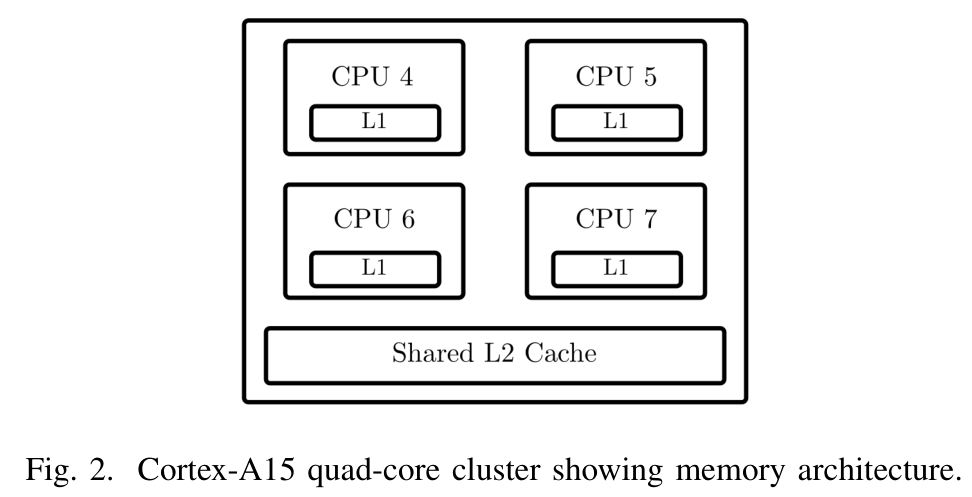

points. The power measurements were collected from power sensors built into the ODROID-XU3 platform. This work considers only the higher performance Cortex-A15 cluster. The four Cortex-A15 CPUs each have 32 KB instruction and data caches, and share a 2 MB L2-cache, as shown in Fig. 2. The clock frequency of the Cortex-A15 cluster ranges from ${ 2 0 0 } \mathrm { M H z }$ to 2 GHz. The SoC also has 2 GB LPDDR3 RAM.

Data is collected for a set of diverse workloads from benchmark suites, including MiBench [24], LMBench [25] and Roy Longbottom [26]. MiBench is a suite of representative embedded workloads. LMBench contains microbenchmarks for activating and testing specific microarchitectural behaviours, such as memory reads at a particular level of cache; Roy Longbottom has many multi-threaded workloads that make heavy use of the NEON SIMD processing unit and OpenMP.

## B. Modelling Methodology

The modelling methodology used in this work, shown in Fig. 1 (a), use hardware PMCs and CPU power measurements to build empirical, run-time CPU power models. There is particular emphasis on creating models that are stable, meaning that the quality of the model is not only judged on the accuracy obtained from testing on a set of workloads, but ensuring that there are small errors in the model coefficients themselves. By using a physically-meaningful model formula; carefully choosing PMC events with low multicollinearity; further reducing multicollinearity with transformations; and using a diverse set of workloads and microbenchmarks, the model knows how each input individually contributes to the overall power consumption. This results in a stable model, which can estimate power over a wide range of workloads more reliably, even if the workload is not well represented in the training data.

An example of stability is presented in [17], which takes a typical regression-based PMC power modelling methodology used in existing works and compares it to the proposed method that considers stability. Both models perform well when they are trained and validated with typical benchmark suites (20 workloads from MiBench [24]) with errors of less than $2 . 5 \%$ in both cases. However, when they are trained with a small set of 20 diverse workloads, and then tested on a large set of 60 diverse workloads, the proposed method (which considers stability) achieves an error of less than $3 . 5 \%$ , whereas the typical existing method achieves an error of larger than $8 \%$ . This shows that using the typical methodology of training and testing the model with typical benchmarks results in a

low perceived error, but a potentially low-quality model that is unable to be accurate when exposed to workloads outside the training set. It also shows how an improved methodology considering stability allows a model to be accurate and reliable when exposed to a large diverse set of workloads that were not necessarily represented in the training set.

The Cortex-A15 power models use the following seven PMCs [17]:

- 0x11 CYCLE COUNT: active CPU cycles

- 0x1B INST SPEC: instructions speculatively executed

- 0x50 L2D CACHE LD: level 2 data cache accesses - read

- 0x6A UNALIGNED LDST SPEC: unaligned accesses

- 0x73 DP SPEC: instructions speculatively executed, integer data processing

- 0x14 L1I CACHE ACCESS: level 1 instruction cache accesses

- 0x19 BUS ACCESS: bus accesses

However, in gem5 suitable event counts for PMC event $0 x 6 A$ and $0 x 7 3$ were not immediately available. These two events were therefore removed and the model was re-built using aforementioned methodology. We then compared the selected five PMCs with the equivalent activity statistics of gem5 and evaluated the re-built model on the hardware platform with a diverse set of workloads.

## C. gem5 Architectural Model and its Evaluation

This section presents an introduction to gem5 simulator [21], followed by modelling of quad-core ARM Cortex-A15 in gem5 using architectural parameters extracted from the hardware platform [27].

1) gem5 architectural model: The gem5 simulator is based on M5 [28], a full system simulator, and GEMS [29], a memory system simulator. It supports four CPU models, namely AtomicSimple, TimingSimple, detailed In-Order (InO) and Out-of-Order (OoO), which differ in simulation time/accuracy trade-off. Detailed InO and OoO are pipelined, cycle-accurate, and support multi-threading for super-scalar. AtomicSimple is a simple one cycle-per-instruction (CPI), non-pipelined and ideal memory CPU model. TimingSimple is also non-pipelined CPU model, but estimates the memory access latencies using reference memory timing. The simple memory system (classic) works by applying delays to each memory request, depending on how they access in the memory hierarchy. It can boot unmodified Linux images in the Full-System (FS) mode. Moreover, existing stats infrastructure of gem5 generates an output file with a large set of activity statistics related to simulation and the model under test, which will be useful for analysing performance, power consumption, etc. We will use this infrastructure to implement the power model into gem5.

Using gem5, a detailed OoO CPU model resembling the quad-core ARM Cortex-A15 on the ODROID-XU3 board, running in FS mode, was created based on general architectural parameters [27], [30], as listed in Table I. As the instruction timing in the execution stage is not publicly available, we configure them in gem5 as per the estimations made in [30]. Integer instructions have latencies of one, four and twelve

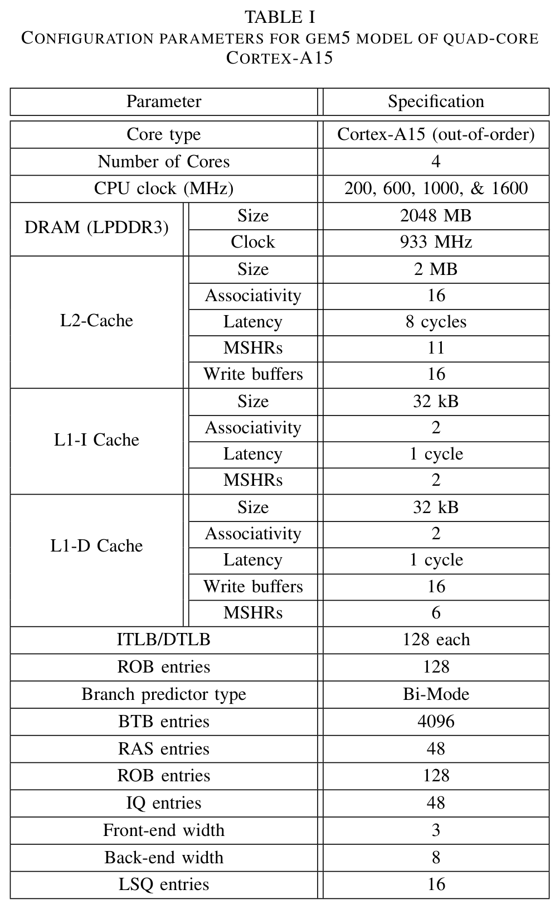

cycles for ALU, multiply and divide respectively, and default latencies for floating point instructions. Further, integer and floating point stages are pipelined. The Cortex-A15 has two levels of translation lookaside buffer (TLB); to compensate the absent second level, instruction-TLB (ITLB) and data-TLB (DTLB) are over-dimensioned.

2) Accuracy Evaluation: We evaluate the difference between the gem5 power model and the real hardware platform in terms of the performance events and execution time. The identified five gem5 activity statistics equivalent to the PMC events on the hardware platform are given in Table II. The data used to build the power model was collected over an extended length of time and repeated to obtain accurate power measurements with a limited power sampling frequency. To make the comparison between the gem5 platform and the hardware model as fair as possible, we took 15 workloads and use the same binaries on both the hardware platform and gem5. The workloads were chosen from the MiBench benchmark suite and were run at four points (200 MHz, 600 MHz, 1000 MHz and 1600 MHz). We compare the difference between the execution time, and the equivalent PMC events (Figure 3). The gem5 architectural model was developed to test and

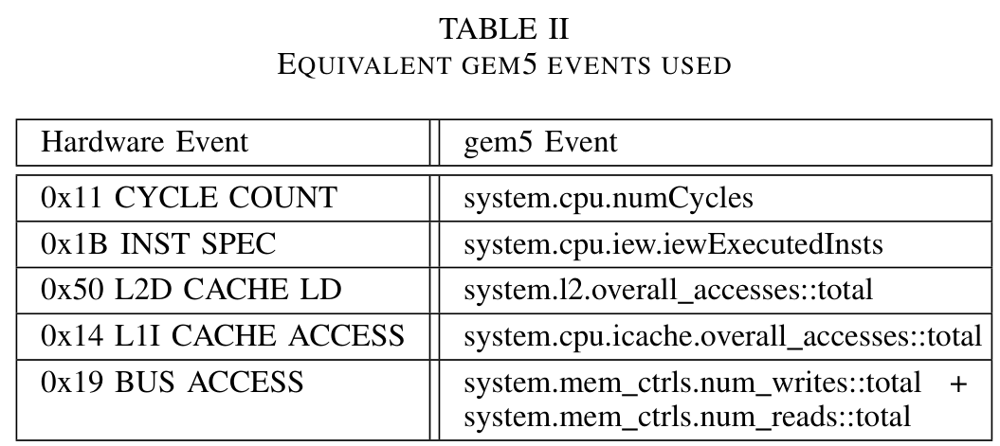

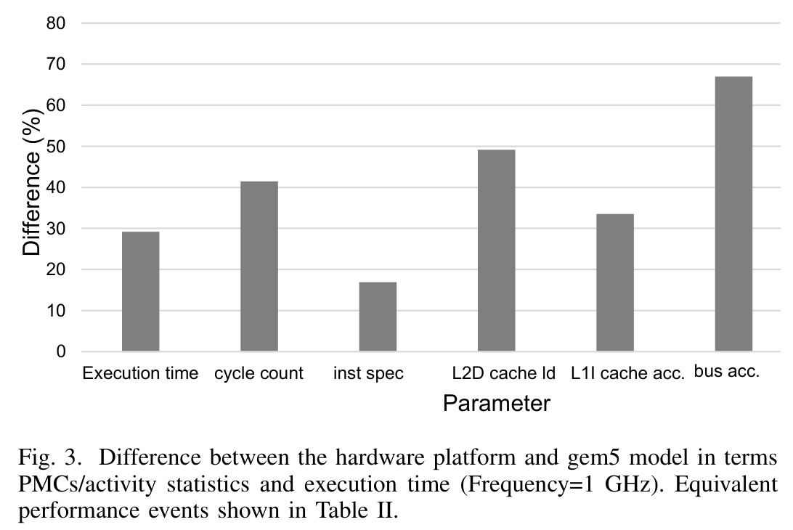

demonstrate the empirical power model, as opposed to being an accurate representation of the ARM Cortex-A15. While the broad CPU parameters were set in the gem5 model (Table I), the simulated execution time and event counters differ from those collected from the hardware platform by over $15 \%$ , as shown in Fig. 3). This error is mainly due to the specification and abstraction error in the simulator, particularly in the TLB models and the front-end of the pipeline [31]. The fetch engine of gem5 only allows a single outstanding access, whereas modern OoO CPUs are fully pipelined allowing multiple parallel accesses to instruction cache lines (A15 has aggressive fetch stage, which has five stages). This specification error in the fetch stage contributes to the I-cache miss error. The specification error in TLB models is also another reason for the reported error in execution time and activity statistics. The TLB models in the gem5 need support for separate TLBs for reads and writes, as well as a second level TLB. This also has multiplicative effect on L2-cache accesses, as each D-TLB miss results in a page table walk that makes multiple accesses into the L2-cache. Moreover, LPDDR3 DRAM in gem5 corresponds to 800 MHz [30], which is supposed to be 933 MHz as per the hardware specifications given in Table I. The effect of difference between gem5 model and real hardware on estimated power consumption is presented in section III.

## D. Integrating the Power Model into gem5

Using the identified gem5 activity statistics equivalent to the PMC events (Table II) on the hardware platform, the empirical power model is implemented into the gem5 simulator. As discussed earlier, the gem5 generates a huge set of activity

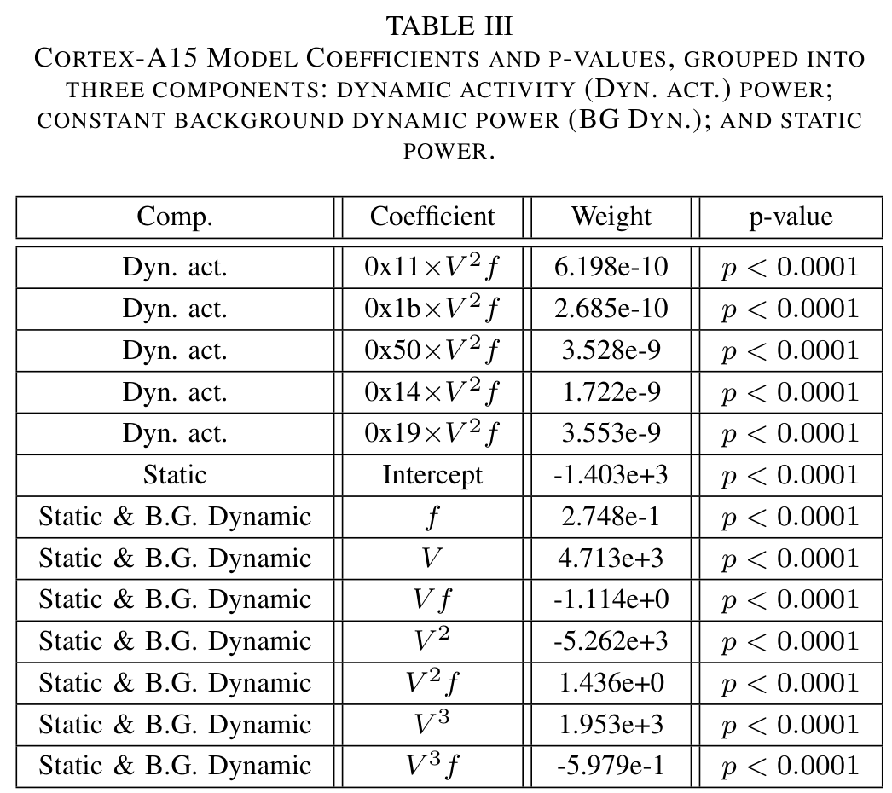

statistics in a file. We use a python script to process the file and to select the required activity statistics, which will be fed into the presented empirical power model.

A key difference between the hardware platform and the gem5 simulation framework is the absence of voltage and temperature sensors in gem5. The modelling methodology used does not use temperature data as an input directly, but does account for the temperature effects due to the CPU voltage level in the static power terms (Table III). However, the temperature due to varying ambient conditions are not accounted for. It is known that both the temperature and CPU current draw affects the (non-ideal) voltage regulator on a real hardware platform [17]. This means that the CPU voltage actually deviates between workloads even when running at a fixed DVFS level. As the gem5 simulator does not simulate the voltage regulator, we use a fixed voltage for each DVFS level that has been calculated from the arithmetic mean of the measured voltage.

## III. RESULTS AND DISCUSSION

In this section, we present the experimental validation of empirical power model on real hardware, followed by accuracy evaluation of the same model implemented into gem5 with respect to real hardware.

## A. Validation of Empirical Power Model on Real Hardware

The coefficients of the presented empirical model are shown in Table III. It can be noted that all the coefficients have corresponding $p$ -values of $p \ < \ 0 . 0 0 0 1$ , showing that each model predictor is statistically very meaningful and that there is less than $0 . 0 1 \%$ of the observed results happening in a random distribution, suggesting a stable model.

Equation 1 shows the final power model [17], where $N$ is the total number of PMC events in the model; $n$ is the index of each event; $E$ is the cluster-wide PMC event rate (eventsper-second) after being divided by the operating frequency in MHz, $f _ { c l k }$ , and averaged across all cores; and $V _ { D D }$ is the

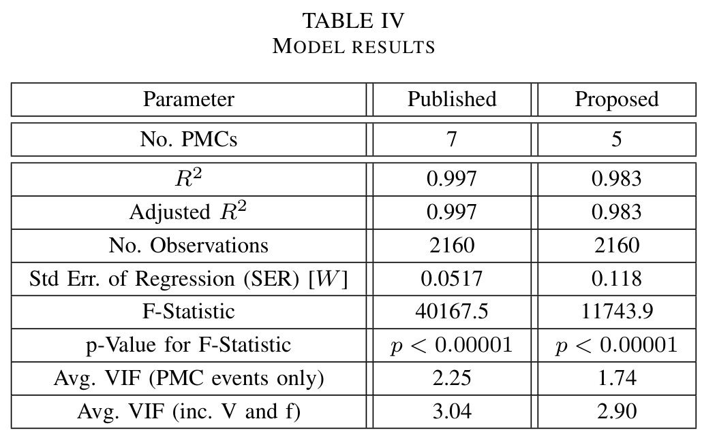

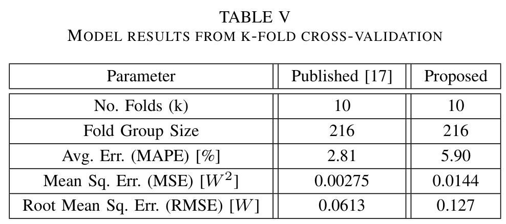

cluster operating voltage. $P _ { c l u s t e r }$ is the power for the overall quad-core Cortex-A15 cluster. This model formula breaks down the power consumed by the dynamic CPU activity and the idle power (which includes the static power and background (BG) switching power, and hence includes the $f _ { c l k }$ term).

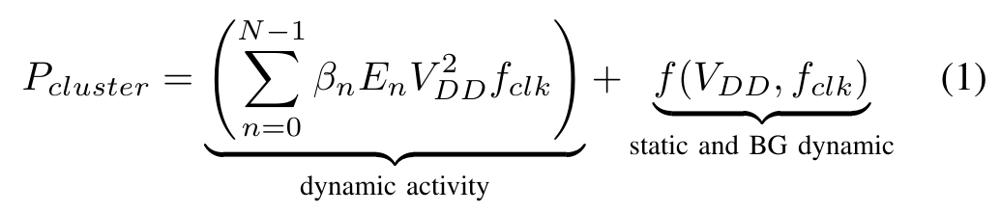

The results from the model published in [17] and the proposed model (identical except two PMC events have been removed) are shown in Table IV. The $R ^ { 2 }$ (coefficient of multiple determination) indicates the goodness-of-fit, showing how close the regression line fits the data points. The published model explains $9 9 . 7 \%$ of the variance whereas our proposed model explains $9 8 . 3 \%$ of the variance. Removing the two events does impact the $R ^ { 2 }$ value but it still remains high.

It is possible to inflate the $R ^ { 2 }$ value by continuing to add variables to the model, even if they are not statistically significant, i.e. over-fitting a model can increase the $R ^ { 2 }$ . The adjusted $R ^ { 2 }$ , is similar to $R ^ { 2 }$ but is adjusted for the number of predictor variables. In both models, the adjusted $R ^ { 2 }$ is identical to the $R ^ { 2 }$ , again suggesting good model stability.

The No. Observations shows the number of data points used to build the model. As the same data is used to build both the existing and proposed models, these are the same.

The standard error of regression (SER, or S), also known as the standard error of the equation (SEE) [32] or the standard error of the estimate [33], is another measure of how well the model fits the data. It gives the average deviation of the data points from the regression lines in watts (W). Therefore,

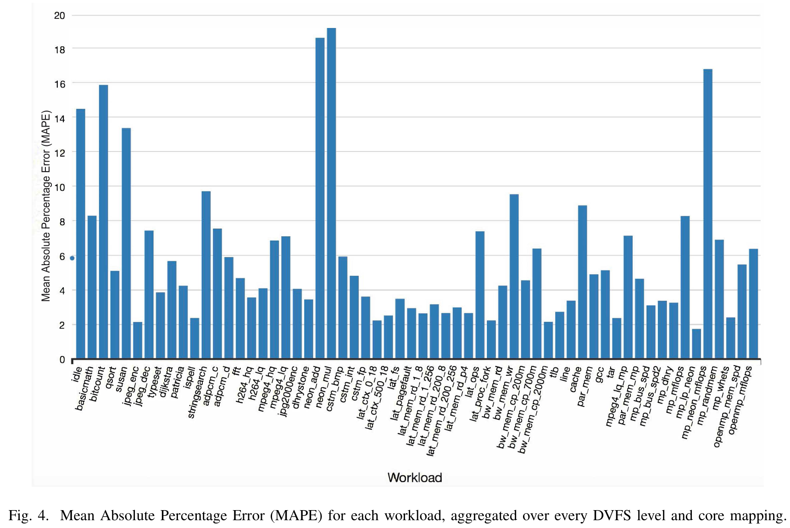

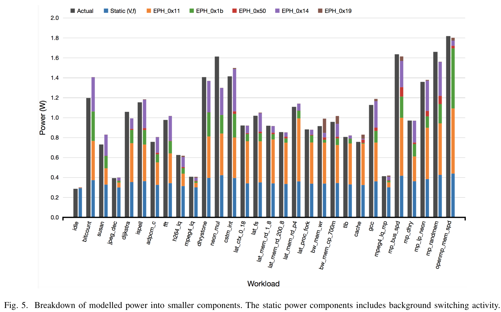

the average distance between a data point and the regression lines is 0.0517 W and 0.118 W for the published and proposed models, respectively. To give context to this value, the Cortex-A15 consumes as little as 0.1 W (idle at $2 0 0 ~ \mathrm { M H z }$ ) and as much as $5 . 1 \mathrm { ~ W ~ }$ (running openmp mflops at $1 8 0 0 ~ \mathrm { M H z }$ ). The average power consumption across all workloads and CPU clock frequencies is 1.0 W.

The variance inflation factor (VIF) is used to test for multicollinearity between the input variables. A lower value indicates a lower amount of multicollinearity between the independent variables which is desirable in a stable model. It is often stated that the VIF should be less than 5-10 [34], [35]. The proposed model has a lower VIF as it has fewer inputs, and therefore a lower correlation between them.

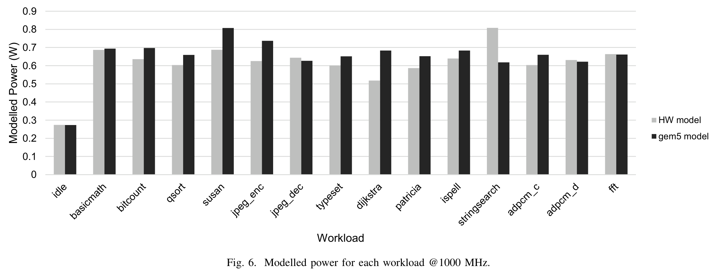

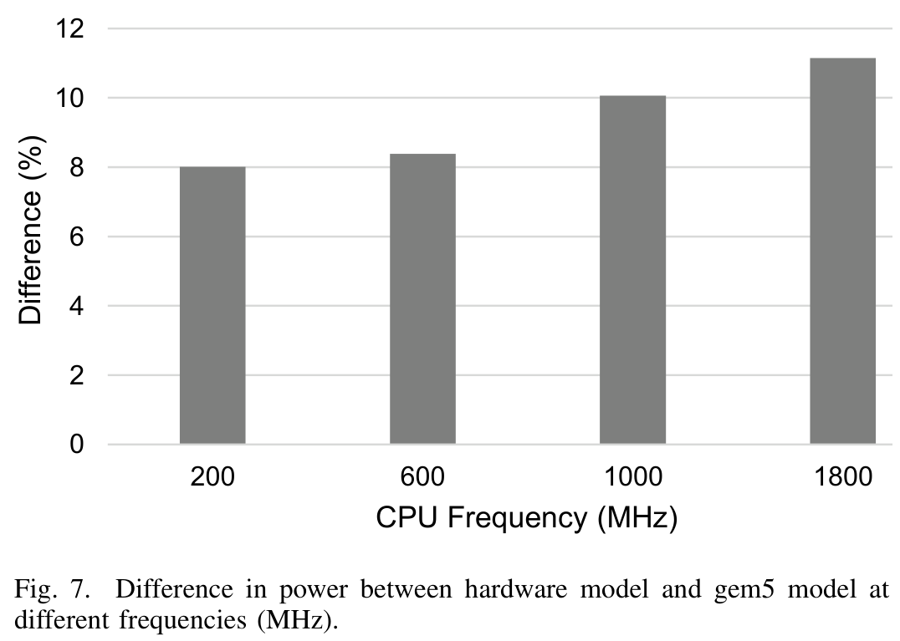

k-fold cross-validation is used to evaluate the mean absolute percentage error (MAPE) and root mean square error (RMSE) (Table V). This involves separating the observations into 10 groups of of 216 $k = 1 0 ,$ ); using 9 groups of observations to build a model and test it on the remaining group; repeat the previous step until all groups have been used as a testing set (i.e. 10 times); and, report the average errors of this process. The proposed model has a larger MAPE of $5 . 9 \%$ compared to the existing model $( 2 . 8 \% )$ because information provided to the model from two PMC events is missing. The MAPE for each individual workload of our proposed model is shown in Fig. 4. The contribution of each individual PMC event, as well as the static and background switching activity, is shown in Fig. 5. The data are the average over all frequencies and bars for only half the workloads are shown for clarity. As discussed in the section III.D, aforementioned empirical power model is implemented into gem5 and its evaluation is presented in the following section.

## B. Evaluation of Integrated Empirical Power Model in gem5

To quantify the effect of the deviation in simulated event counters (activity statistics) on the power consumption, we

implement the power model on this newly collected data with 15 workloads on hardware and compare it with the model implemented in gem5 (Fig. 6 and 7). There is only a small deviation between the hardware model and the gem5 model across the workloads, despite some of the model inputs having a larger error (Fig. 5). This is because a proportion of the power estimation is made up of static power (independent of PMCs) and because the errors in the events cancel each other out to a certain extent. The error is lower at lower DVFS levels because a larger proportion of the total power consumption is made up of the static power, which is not dependent on the simulated events. It can be observed from Fig. 6 that the power model in gem5 produces reliable power numbers which can be useful for producing accurate research conclusions. To further validate the accuracy of integrated model, we considered multiple frequency points $( 2 0 0 ~ \mathrm { M H z }$ $6 0 0 ~ \mathrm { { \ M H z } }$ , 1000 MHz, and 1600 MHz) and collected data from hardware and gem5 to feed into the power model. The average difference in estimated power on real hardware and gem5 model is less than $10 \%$ across the 15 workloads at four frequencies, which shows the improved reliability of the presented empirical model in gem5.

## IV. CONCLUSIONS

We have developed and validated an accurate and stable power model using data collected from a real ARM-based mobile platform. The model is found to have an average error of less than $6 \%$ when validated against 60 workloads at 9 DVFS levels and four core mappings (2,160 observations). We built this model with PMC events that are readily available in gem5. We then implement the model equation into the gem5 simulator itself using the in-built power modelling framework. This allows a user of gem5 to model a CPU with a similar configuration to the modelled ARM Cortex-A15 and obtain representative power numbers. To test and demonstrate the implemented power model, create a gem5 model of a quadcore CPU resembling the ARM Cortex-A15. While the are discrepancies between the simulated statistics in gem5 and the real hardware platform, we show that the these discrepancies

only impact the estimated power consumption by $10 \%$ . This still represents to date the best reported correlated results between simulation and measured of multicore processors power consumption in gem5 representing a significant step forward towards achieving meaningful and placing confidence in power-performance results generated by gem5.

## ACKNOWLEDGMENT

This work was supported by EPSRC Grant EP/K034448/1 (the PRiME Programme www.prime-project.org). Experimental data used in this paper can be found at DOI: 10.5258/SO-TON/D0173 (https://doi.org/10.5258/SOTON/D0173).

## REFERENCES

- [1] S. Li, J. H. Ahn, R. Strong, J. Brockman, D. Tullsen, and N. Jouppi, “Mcpat: An integrated power, area, and timing modeling framework for multicore and manycore architectures,” in Microarchitecture, 2009. MICRO-42. 42nd Annual IEEE/ACM Int. Symp., Dec 2009, pp. 469–480.

- [2] S. Thoziyoor, J. H. Ahn, M. Monchiero, J. B. Brockman, and N. P. Jouppi, “A comprehensive memory modeling tool and its application to the design and analysis of future memory hierarchies,” in Proceedings of the 35th Annual International Symposium on Computer Architecture, ser. ISCA ’08. Washington, DC, USA: IEEE Computer Society, 2008, pp. 51–62. [Online]. Available: http://dx.doi.org/10.1109/ISCA.2008.16

- [3] D. Brooks, V. Tiwari, and M. Martonosi, Wattch: a framework for architectural-level power analysis and optimizations. ACM, 2000, vol. 28, no. 2.

- [4] R. Miftakhutdinov, E. Ebrahimi, and Y. N. Patt, “Predicting performance impact of dvfs for realistic memory systems,” in 2012 45th Annual IEEE/ACM International Symposium on Microarchitecture, Dec 2012, pp. 155–165.

- [5] A. Lukefahr, S. Padmanabha, R. Das, F. M. Sleiman, R. Dreslinski, T. F. Wenisch, and S. Mahlke, “Composite cores: Pushing heterogeneity into a core,” in 2012 45th Annual IEEE/ACM International Symposium on Microarchitecture, Dec 2012, pp. 317–328.

- [6] C. Torng, M. Wang, and C. Batten, “Asymmetry-aware work-stealing runtimes,” in 2016 ACM/IEEE 43rd Annual International Symposium on Computer Architecture (ISCA), June 2016, pp. 40–52.

- [7] F. M. Sleiman and T. F. Wenisch, “Efficiently scaling out-of-order cores for simultaneous multithreading,” in Proceedings of the 43rd International Symposium on Computer Architecture, ser. ISCA ’16. Piscataway, NJ, USA: IEEE Press, 2016, pp. 431–443. [Online]. Available: https://doi.org/10.1109/ISCA.2016.45

- [8] A. Mukkara, N. Beckmann, and D. Sanchez, “Whirlpool: Improving dynamic cache management with static data classification,” in Proceedings of the Twenty-First International Conference on Architectural Support for Programming Languages and Operating Systems, ser. ASPLOS ’16. New York, NY, USA: ACM, 2016, pp. 113– 127. [Online]. Available: http://doi.acm.org/10.1145/2872362.2872363

- [9] F. Bellosa, “The benefits of event: Driven energy accounting in powersensitive systems,” in Proc. 9th Workshop on ACM SIGOPS European Workshop: Beyond the PC: New Challenges for the Operating System, ser. EW 9. New York, NY, USA: ACM, 2000, pp. 37–42.

- [10] C. Isci and M. Martonosi, “Runtime power monitoring in high-end processors: methodology and empirical data,” in Microarchitecture, 2003. MICRO-36. Proc. 36th Annu. IEEE/ACM Int. Symp., Dec 2003, pp. 93–104.

- [11] R. Bertran, M. Gonzalez, X. Martorell, N. Navarro, and E. Ayguade, “Decomposable and responsive power models for multicore processors using performance counters,” in Proc. 24th ACM Int. Conf. Supercomputing, ser. ICS ’10. New York, NY, USA: ACM, 2010, pp. 147–158.

- [12] W. Bircher and L. John, “Complete system power estimation using processor performance events,” Computers, IEEE Transactions on, vol. 61, no. 4, pp. 563–577, April 2012.

- [13] W. Lee, Y. Kim, J. H. Ryoo, D. Sunwoo, A. Gerstlauer, and L. K. John, “Powertrain: A learning-based calibration of mcpat power models,” in The IEEE Int. Symp. on Low Power Electronics and Design (ISLPED), July 2015.

- [14] S. L. Xi, H. Jacobson, P. Bose, G.-Y. Wei, and D. Brooks, “Quantifying sources of error in mcpat and potential impacts on architectural studies,” in High Performance Computer Architecture (HPCA), 2015 IEEE 21st Int. Symp. on, Feb 2015, pp. 577–589.

- [15] A. Butko, R. Garibotti, L. Ost, and G. Sassatelli, “Accuracy evaluation of gem5 simulator system,” in 7th International Workshop on Reconfigurable and Communication-Centric Systems-on-Chip (ReCoSoC), July 2012, pp. 1–7.

- [16] T. Nowatzki, J. Menon, C.-H. Ho, and K. Sankaralingam, “Gem5, gpgpusim, mcpat, gpuwattch, ”your favorite simulator here” considered harmful,” in 11th Annual Workshop on Duplicating, Deconstructing and Debunking, 2014.

- [17] M. J. Walker, S. Diestelhorst, A. Hansson, A. K. Das, S. Yang, B. M. Al-Hashimi, and G. V. Merrett, “Accurate and stable run-time power modeling for mobile and embedded cpus,” IEEE Transactions on Computer-Aided Design of Integrated Circuits and Systems, vol. 36, no. 1, pp. 106–119, Jan 2017.

- [18] M. J. Walker, S. Diestelhorst, A. Hansson, D. Balsamo, G. V. Merrett, and B. M. Al-Hashimi, “Thermally-aware composite run-time cpu power models,” in 2016 26th International Workshop on Power and Timing Modeling, Optimization and Simulation (PATMOS), Sept 2016, pp. 17– 24.

- [19] T. Austin, E. Larson, and D. Ernst, “Simplescalar: An infrastructure for computer system modeling,” Computer, vol. 35, no. 2, pp. 59–67, 2002.

- [20] A. Patel, F. Afram, and K. Ghose, “Marss-x86: A qemu-based microarchitectural and systems simulator for x86 multicore processors,” in 1st International Qemu Users Forum, 2011, pp. 29–30.

- [21] N. Binkert, B. Beckmann, G. Black, S. K. Reinhardt, A. Saidi, A. Basu, J. Hestness, D. R. Hower, T. Krishna, S. Sardashti, R. Sen, K. Sewell, M. Shoaib, N. Vaish, M. D. Hill, and D. A. Wood, “The gem5 simulator,” SIGARCH Comput. Archit. News, vol. 39, no. 2, pp. 1–7, Aug. 2011.

- [22] A. Butko, F. Bruguier, A. Gamatie, G. Sassatelli, D. Novo, L. Torres, and ´ M. Robert, “Full-system simulation of big. little multicore architecture for performance and energy exploration,” in Embedded Multicore/Manycore Systems-on-Chip (MCSoC), 2016 IEEE 10th International Symposium on. IEEE, 2016, pp. 201–208.

- [23] M. J. Walker, S. Diestelhorst, A. Hansson, D. Balsamo, B. M. Al-Hashimi, and G. V. Merrett, “POWMON: Run-Time CPU Power Modelling,” http://www.powmon.ecs.soton.ac.uk/powermodeling, Dec 2015, [Online; accessed 21-May-2016].

- [24] M. Guthaus, J. Ringenberg, D. Ernst, T. Austin, T. Mudge, and R. Brown, “Mibench: A free, commercially representative embedded benchmark suite,” in Workload Characterization, 2001. WWC-4. 2001 IEEE Int. Workshop on, Dec 2001, pp. 3–14.

- [25] L. W. McVoy, C. Staelin et al., “lmbench: Portable tools for performance analysis.” in USENIX annual technical conference. San Diego, CA, USA, 1996, pp. 279–294.

- [26] R. Longbottom, “Roy longbottom’s pc benchmark collection,” http:// www.roylongbottom.org.uk, September 2014, [Online; accessed 2-June-2015].

- [27] Samsung, “Exynos octa soc,” 2015. [Online]. Available: https://http: //www.samsung.com

- [28] N. L. Binkert, R. G. Dreslinski, L. R. Hsu, K. T. Lim, A. G. Saidi, and S. K. Reinhardt, “The M5 simulator: Modeling networked systems,” IEEE Micro, no. 4, pp. 52–60, 2006.

- [29] M. M. Martin, D. J. Sorin, B. M. Beckmann, M. R. Marty, M. Xu, A. R. Alameldeen, K. E. Moore, M. D. Hill, and D. A. Wood, “Multifacet’s general execution-driven multiprocessor simulator (GEMS) toolset,” ACM SIGARCH Computer Architecture News, vol. 33, no. 4, pp. 92–99, 2005.

- [30] F. A. Endo, D. Courousse, and H.-P. Charles, “Micro-architectural ´ simulation of embedded core heterogeneity with gem5 and mcpat,” in Proceedings of the 2015 Workshop on Rapid Simulation and Performance Evaluation: Methods and Tools. ACM, 2015, p. 7.

- [31] A. Gutierrez, J. Pusdesris, R. G. Dreslinski, T. Mudge, C. Sudanthi, C. D. Emmons, M. Hayenga, and N. Paver, “Sources of error in full-system simulation,” in 2014 IEEE International Symposium on Performance Analysis of Systems and Software (ISPASS), March 2014, pp. 13–22.

- [32] F. Hayashi, Econometrics. Princeton University Press, 2011.

- [33] R. Nau, “Statistical forecasting: notes on regression and time series analysis,” https://people.duke.edu/∼rnau/411home.htm, January 2017, [Online; accessed 11-May-2017].

- [34] by Michael Kutner, C. Nachtsheim, and J. Neter, Applied Linear Regression Models, 4th ed. McGraw-Hill Education, January 2004.

- [35] J. F. H. Jr, W. C. Black, B. J. Babin, and R. E. Anderson, Multivariate Data Analysis, 7th ed. Prentice Hall, February 2009.
