Latest updates: https://dl.acm.org/doi/10.1145/3763084

RESEARCH-ARTICLE

## Revamping Verilog Semantics for Foundational Verification

JOONWON CHOI, Amazon.com, Inc., Seattle, WA, United States

JAEWOO KIM, Korea Advanced Institute of Science and Technology, Daejeon, South Korea

JEEHOON KANG, Korea Advanced Institute of Science and Technology, Daejeon, South Korea

Open Access Support provided by:

Amazon.com, Inc.

Korea Advanced Institute of Science and Technology

Citation in BibTeX format

## Revamping Verilog Semantics for Foundational Verification

JOONWON CHOI\*, Amazon Web Services, USA

JAEWOO KIM*, KAIST, Republic of Korea

JEEHOON KANG, KAIST / FuriosaAI, Republic of Korea

In formal hardware verification, particularly for Register-Transfer Level (RTL) designs in Verilog, model checking has been the predominant technique. However, it suffers from state explosion, limited expressive power, and a large trusted computing base (TCB). Deductive verification offers greater expressive power and enables foundational verification with a minimal TCB. Nevertheless, Verilog's standard semantics, characterized by its nondeterministic and global scheduling, pose significant challenges to its application.

To address these challenges, we propose a new Verilog semantics designed to facilitate deductive verification. Our semantics is based on least fixpoints to enable cycle-level functional evaluation and modular reasoning. For foundational verification, we prove our semantics equivalent to the standard scheduling semantics for synthesizable designs. We demonstrate the benefits of our semantics with a modular verification of a pipelined RISC-V processor's functional correctness and progress guarantees. All our results are mechanized in Rocq.

CCS Concepts: $\cdot$ Hardware $\rightarrow$ Hardware description languages and compilation; $\cdot$ Theory of computation $\rightarrow$ Program semantics; Program reasoning.

Additional Key Words and Phrases: deductive verification, interactive theorem proving, Verilog, Rocq

## ACM Reference Format:

Joonwon Choi, Jaewoo Kim, and Jeehoon Kang. 2025. Revamping Verilog Semantics for Foundational Verification. Proc. ACM Program. Lang. 9, OOPSLA2, Article 306 (October 2025), 28 pages. https://doi.org/10.1145/3763084

## 1 Introduction

Formal verification of hardware designs has been a longstanding research focus. Model checking [12, 13, 38] has been the predominant technique, but it faces significant challenges due to state explosion, particularly with register-transfer-level (RTL) hardware designs described in languages like Verilog [2]. Furthermore, model checkers are typically limited to quantifier-free properties. Even when the underlying reasoning principles are logically sound, model checkers are inherently part of the trusted computing base (TCB) to ensure the correct implementation of their extensive theories and optimizations. While attempts have been made to verify model checkers [18, 45] to minimize the TCB, their efficiency remains insufficient for practical application.

Deductive verification has recently emerged as a promising alternative for foundational verification [37, 43] with a minimal TCB. Unlike model checking's automatic state-space exploration, deductive verification requires users to manually construct proofs, which are then machine-checked for correctness. By leveraging the expressive power of higher-order logic, users can state and prove

complex correctness theorems. This approach reduces the TCB to the formal semantics and correctness conditions defined within a theorem prover, and the theorem prover itself, which has no domain-specific knowledge of hardware.

Challenge: complex standard semantics of Verilog. Deductive foundational verification for hardware designs, though promising, encounters substantial difficulties due to the complexity of RTL semantics. Modern hardware design toolchains heavily rely on RTL languages for high-performance designs. Consequently, foundational hardware verification should ideally be conducted against the standard semantics of these languages, as defined for Verilog [2]. However, the inherent complexity of the standard Verilog semantics poses substantial obstacles to direct formal proofs.

First, Verilog's standard semantics employ nondeterministic scheduling based on an event-driven execution model, where multiple design blocks react to value updates in a nondeterministic order. While this allows Verilog to function as both a synthesizable hardware description and a simulation model, the inherent nondeterminism mandates consideration of all possible execution orders, complicating verification and limiting scalability (see §2.2 for details).

Second, the standard semantics employ a global scheduling that impedes modular reasoning. Although Verilog supports modular construction via submodules, its standard semantics disregard module boundaries, treating submodules as inlined and scheduling all updates across modules together. Consequently, submodule blocks can interleave arbitrarily with those in the enclosing module, making it difficult to define meaningful abstractions for submodules (see §2.3 for details).

Therefore, to our knowledge, no existing foundational hardware verification has been conducted against the standard semantics of Verilog. While prior work has explored translating RTL languages to or from languages with simpler semantics [19, 22, 47], these translations themselves have not been verified. While simpler semantics for a subset of Verilog has been proposed [31, 36], these simplifications were unverified and forbid hierarchical designs with submodules. Alternatively, recent approaches have reduced the significant manual effort in theorem proving by designing and verifying high-level hardware models or modules described in abstract HDLs [6, 9, 11]. However, they do not directly relate to the industry-standard RTL languages like Verilog.

Solution: verification-friendly semantics. To streamline deductive foundational verification of hardware, we introduce a new formal semantics for Verilog, which we prove equivalent to the standard semantics. $^{1}$ The key observation is that nondeterministic and global scheduling primarily impacts non-synthesizable or rarely used designs. In practice, widely adopted coding guidelines [14] ensure synthesizable and deterministic designs. Therefore, we focus on this subset of Verilog, designing a new semantics with the following advantages.

First, we define our semantics as a cycle-level function that evaluates all block transitions within the current cycle by wrapping block-level transitions using a least fixpoint (LFP) operator. Consequently, our semantics is essentially a state-transition function, enabling deterministic evaluation of the state at the next cycle through function applications.

Second, we define a modular semantics that facilitates modular verification. Specifically, the denotation of a submodule instantiation is defined through the submodule's transition function, enabling us to initially prove properties for the submodule's transitions. These properties are then utilized as abstractions when reasoning about the parent module. Using this approach, we conduct a modular verification of a pipelined RISC-V processor.

Third, to enable foundational verification with a minimal TCB, we formally prove our semantics equivalent to the standard scheduling semantics for Verilog designs that adhere to the guidelines.

This equivalence demonstrates that, for these modules, the inherent nondeterminism of the standard semantics is inconsequential, as any execution order within a state transition yields the same next state. To this end, we faithfully formalize Verilog's natural language semantics [2], incorporating the fix proposed by Lööw [35] to address a known defect in the standard. While prior research has proposed modular or cycle-level functional semantics, ours is the first to be proven equivalent to the standard scheduling semantics (see §6 for detailed comparisons).

Outline. In §2, we provide the necessary background to motivate this work. In §3, we define a modular formal semantics for Verilog defined as a cycle-level transition function using LFP. In §4, we formalize the Verilog standard scheduling semantics and prove its equivalence to our semantics. In §5, we extend our state-transition function to multi-cycle trace semantics, demonstrating a modular verification of a simple pipelined processor. In §6, we compare our verification framework with other verification frameworks for Verilog. In §7, we conclude with related and future work.

## 2 Background and Motivation

We review the standard scheduling semantics of Verilog (§2.1) and discuss its drawbacks that motivate our new semantics: nondeterminism (§2.2) and lack of modularity (§2.3).

## 2.1 The Standard Scheduling Semantics of Verilog

The IEEE standard [2] provides a formal definition of the complete Verilog syntax and semantics. However, not all Verilog modules can be synthesized into physical circuits, as Verilog is also used for software-driven simulation. For instance, Verilog includes non-synthesizable syntactic components that define simulation processes and their controls.

To encompass the behaviors of both synthesizable and simulation modules, the standard employs scheduling semantics: each hardware block is treated as a process triggered by an event, forming a concurrent reactive system. Events can be generated in various ways, e.g., an "update" event is generated when a state value changes. Assignments within a block's execution can trigger other blocks, leading to concurrent execution. In such cases, the scheduling semantics makes a nondeterministic choice regarding which block to execute next: either resuming the current block after the assignment or initiating a newly triggered block. By repeatedly executing assignments whenever a right-hand side operand is updated, the scheduling semantics ensures that all value-update dependencies are eventually resolved. This seemingly complex semantics is primarily motivated by the need to support Verilog components for simulation, which are not synthesizable.

To manage the complexity of the standard semantics, we focus on the synthesizable and synchronous subset of Verilog. For synthesizable synchronous designs, designers strive to minimize nondeterminism, as it can cause the synthesized circuit to deviate from the intended behavior. Consequently, designers adhere to well-established guidelines [14] to eliminate nondeterminism. We target such deterministic and synthesizable designs (see §3.1 for the detailed coverage).

## 2.2 Nondeterminism

We now discuss the drawbacks of the standard semantics in deductive verification, beginning with nondeterminism. Figure 1 presents two Verilog modules that illustrate the nondeterministic nature of scheduling semantics. The module example contains an assignment (assign d_quad = ...) at line 5. Subsequently, an always_comb ("always") block at line 6 defines a combinational circuit. Within this block, a blocking assignment (d_db1 = d_cnt) prevents the execution of subsequent statements until it completes. In this example, d_db1 = d_cnt executes first, and then d_db1 += d_cnt executes, updating d_db1 with (2 * d_cnt). In the case of d_quad, multiple resolution steps are required due to

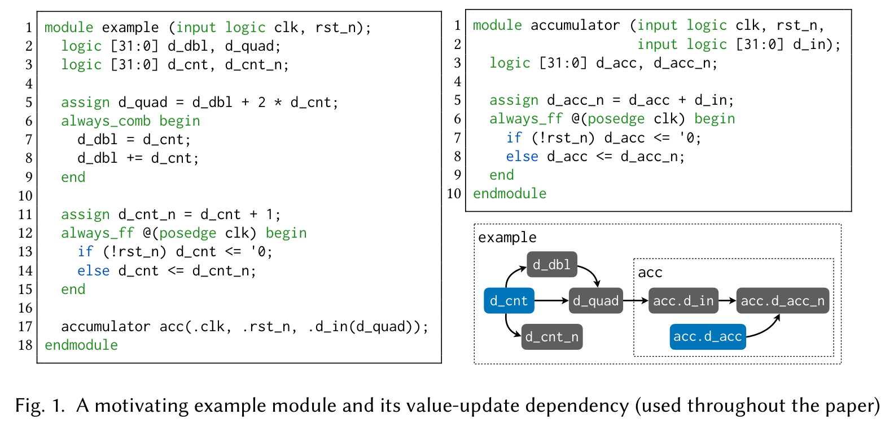

the chain of updates. Specifically, in order to evaluate the assignment to d_quad (at line 5) correctly, d_db1 should be evaluated first. The value of d_db1 is evaluated when the "always" block (at line 6) is evaluated. These value-update dependencies are illustrated on the right side of Figure 1.

As discussed in §2.1, the standard resolves these dependencies nondeterministically. Particularly, each update to d_cnt generates an event, triggering assignments sensitive to d_cnt, namely those for d_quad, d_db1, and d_cnt_n. However, the execution order of these triggered assignments is nondeterministic. This nondeterminism introduces multiple possible execution paths, requiring reasoning about all such paths. We further elaborate on this complexity through two key aspects: parallel executions and spurious updates.

Parallel executions. First, the standard semantics requires considering all possible execution orders of updates, even when the updates are independent of each other, and thus any execution order leads to the same state transition.

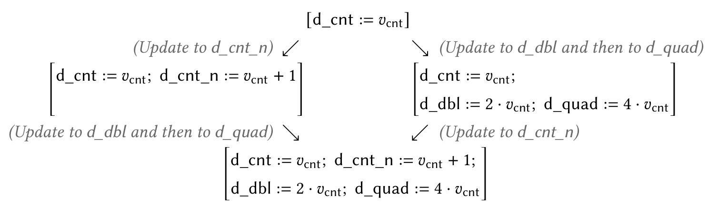

The figure above illustrates two distinct execution orders of the example module, both of which result in the same final state. When d_cnt is updated, it triggers two blocks: one that updates d_cnt_n, and another that updates d_db1, followed by d_quad. As shown in the figure, these updates are orthogonal, indicating that the final state is the same regardless of the execution path: whether d_cnt_n is updated first (left path) or d_db1 and d_quad are updated first (right path). Nevertheless, under the standard semantics, both execution paths should still be considered.

Spurious updates. Furthermore, under the standard semantics, assignments may be executed unnecessarily when the values of right-hand-side operands are stale.

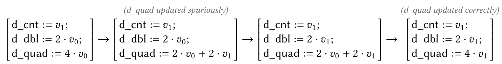

The figure above shows an execution that includes a spurious update. When $\mathrm{d\_cnt}$ is updated (from $v_{0}$ to $v_{1}$ ), executing the assignment to $\mathrm{d\_quad}$ is spurious, as $\mathrm{d\_dbl}$ has not yet been updated ( $\mathrm{d\_quad}$ is incorrectly updated to $2 \cdot v_{0} + 2 \cdot v_{1}$ ). Once $\mathrm{d\_dbl}$ is updated to $2 \cdot v_{1}$ , $\mathrm{d\_quad}$ subsequently obtains the correct value $(4 \cdot v_{1})$ .

Logical time steps. In the standard semantics, state transitions occur through a logical step within a clock cycle, making the semantics more difficult to use. Specifically, the scheduling semantics introduces time slots, where each slot executes all events scheduled for that slot, including clock ticks, input changes, and any new events generated during event execution. A logical state transition is necessary, as there is generally no clear correspondence to a physical time step. For example, if a Verilog module is driven by multiple separate physical clocks, defining a single physical time step becomes infeasible.

In practice, when reasoning about synchronous hardware, it is often more intuitive to consider state transitions that encompass the entire state update for each clock cycle. For example, when proving an invariant, we typically use induction: assuming the invariant holds in the current state, we then prove it holds at the next state. If this "next state" were defined more granularly than a clock cycle—such that each transition updates only part of the state—this induction proof might not always work.

Prior approach: relational semantics. To address nondeterminism for designs that adhere to the guidelines (thus deterministic and synthesizable), a common approach employs relational semantics [42]. In this approach, a wire $\mathfrak{p}$ is related to a value $v$ , denoted by $\mathcal{E}(p,v)$ , if the assignment to $\mathfrak{p}$ evaluates to $v$ . Then the semantics for the wires in example can be expressed as follows:

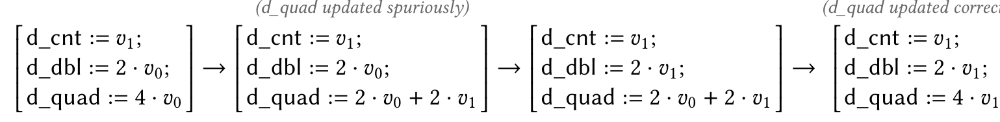

With this approach, evaluating a variable still requires a proof derivation, which may involve a lengthy chain of entailments to resolve dependencies. For instance, to derive the value of d_quad, one must first derive the value of d_db1, which, in turn, requires deriving the value of d_cnt beforehand. Furthermore, these relations have not been verified to hold under the nondeterministic value updates of the scheduling semantics.

Our approach. To address the bottlenecks discussed so far, we define a formal semantics using a state-transition function, avoiding redundancy and relational deduction. To avoid explicitly modeling logical steps, we assume a single clock domain and define the function to operate per each physical cycle time. In this case, a state transition in our semantics corresponds to two separate logical steps in the standard—one triggered by inputs and the other by the clock. This simplification is achievable under the assumption that input-value updates and a clock tick do not occur simultaneously. We will elaborate on this assumption further in §4, where we provide an equivalence proof between our (physically timed) formal semantics and the (logically timed) standard.

Our equivalence proof leverages confluence. We prove that value updates are confluent for designs adhering to the guidelines, which ensures a unique final state regardless of the update order (see §4 for details). This property allows us to define a deterministic transition function by fixing a specific update order (see §3 for details).

## 2.3 Lack of Modularity

A crucial requirement for scalable deductive verification is modular semantics. In large hardware designs with multiple submodule instances, it is often more efficient to evaluate the semantics of each submodule separately and then compose them. For instance, once a submodule's semantics is defined, it can be reused when the parent module contains multiple instances of that submodule. Additionally, modular semantics enables encapsulation of a submodule's behavior by proving necessary properties within its semantics, which can then be used to verify the parent module.

The standard semantics lacks modularity. It essentially disregards module boundaries, treating input/output port connections between submodules and their parent just as assignments.

Our approach. Our semantics is modular in that the state-transition function for a module takes those for its submodules as arguments and uses them to construct the function. For instance, the example module in Figure 1 includes a submodule acc. In our semantics, the transition function of example is defined by incorporating the one for acc, which can be constructed independently since the accumulator module does not contain any further instances (see §3 for details).

## 3 Formal Semantics of Verilog as a Transition Function

As preliminaries, we outline our coverage (§3.1), define the syntax (§3.2), and introduce the semantic domain (§3.3). We then define the functional semantics by specifying the semantic transfer function, which resolves one value-update dependency per step (§3.4), and iteratively applying this function with LFP to yield the state-transition function (§3.5). For concreteness, we will frequently reference the motivating example shown in Figure 1.

## 3.1 Coverage

As mentioned in §2, we aim to support synthesizable, deterministic, and synchronous Verilog designs.

Synthesizable designs. We support a broad set of synthesizable Verilog syntax, enabling the interpretation of practical open-source designs like the PicoRV32 CPU core [1] (around 2.2K lines of code after preprocessing) and our case-study processor ( $\S 5$ ). We have expanded our coverage on a demand-driven basis, as it is primarily an engineering task.

For clarity, we provide a list of unsupported components. We support wires and registers, but not latches. We support all expression types except for tagged unions, and all statement types except for tasks and manual sensitivity lists. We currently do not support typedef, enum, or alias at the block level; case- and for-generate constructs for generate blocks; and interface and package at the module level and beyond.

Deterministic designs. In addition to limiting our coverage to synthesizable designs, we also require them to adhere to well-established guidelines [14] widely regarded by designers as best practices for deterministic Verilog modules. Our framework maintains a simple static predicate to ensure that the target design follows these guidelines. The purpose of the guidelines is to ensure that the design is free of race conditions between value updates. Specifically, the guidelines are: (1) use nonblocking assignments for sequential logic or latches, (2) use blocking assignments for combinational logic in an always block, (3) use nonblocking assignments when modeling both sequential and combinational logic in the same always block, (4) avoid mixing blocking and nonblocking assignments in the same always block, and (5) ensure that no variable is assigned, whether blocking or nonblocking, in more than one always block. Interested readers may refer to the guidelines for an intuition behind each item.

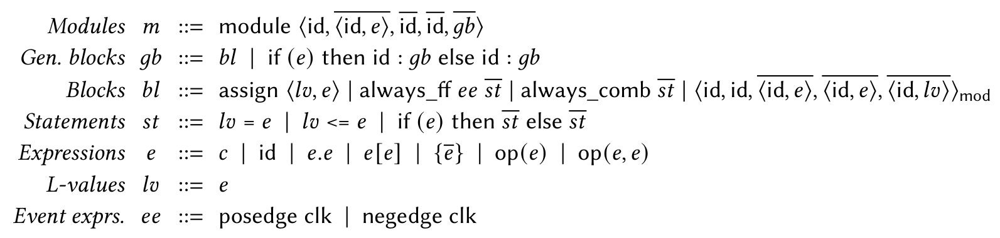

Fig. 2. Formal syntax of Verilog (excerpts)

Single-clock designs. We target single-clock synchronous designs, where all state transitions are coordinated by a single global clock signal. Extending our semantics to support multiple independent clock domains is important future work and would require a robust message-passing model to handle clock-domain crossings (CDCs), where synchronizers are typically employed to manage metastability and nondeterminism [20]. Additionally, we currently restrict our coverage to single-edge designs, utilizing only the positive or negative edge of the clock signal. We consider double-edge designs to have limited practical applicability relative to the semantic complexity they add. Nevertheless, our semantics could be straightforwardly extended to support double-edge designs by independently evaluating transitions induced by positive and negative edges, then composing the results as needed.

Bit values. We restrict bit values to the standard Boolean set: $\emptyset$ and $1$ . We omit support for high-impedance bit values (Z), since multi-driven nets are prohibited by the guidelines. Additionally, we exclude unknown bit values (X) due to the well-known semantic divergence between their standard semantics and their behavior in synthesized circuits [46, 51]. This inconsistency arises because the standard defines X as a distinct bit value with its own computational rules, whereas synthesis tools treat it as a don't-care value, freely assigning either $\emptyset$ or $1$ . For example, while the standard dictates that a conditional branch with an unknown value (if $(1'bx)$ ) is never taken, a synthesized circuit might assign a value of 1 and execute the branch.

## 3.2 Syntax

Figure 2 presents the formal syntax of Verilog (excerpts). We first define terms used throughout the paper. Here, an overline $(e.g.,\bar{l})$ denotes a list, and $[], (e::\bar{l})$ , and $(\overline{l_1} +\overline{l_2})$ denote empty, cons, and append, respectively. We use $\langle \cdot \rangle$ to denote a tuple. A tuple may have a label $(e.g.,\langle \cdot \rangle_{\mathrm{label}})$ for distinction. Lastly, we overload the array-access operation to access the i-th element of a tuple $t$ , i.e., $t[i]$ .

Expressions (represented as "e") are the smallest value-producing unit. Expressions include a literal $(c)$ , an ID (id), a hierarchy selection $(e.e)$ , an index selection $(e[e])$ , a concatenation $(\{\overline{e}\})$ , a unary operation $(\mathrm{op}(e))$ , and a binary operation $(\mathrm{op}(e,e))$ . $L$ -values ("lv") in the Verilog standard syntax are a subset of expressions. For simplicity, we identify L-values with expressions: our formal semantics does not accept L-values constructed from illegal expressions. Event expressions ("ee") are either a positive (posedge clk) or negative (negedge clk) edge event of the global clock signal.

Statements ("st") contain elements that are used to build a circuit block. Statements include a blocking assignment $(lv = e)$ , a nonblocking assignment $(lv <= e)$ , and a conditional statement (if $(e)$ then $\overline{st}$ else $\overline{st}$ ). In practice, blocking assignments are used to form combinational logic, while nonblocking assignments are used for sequential logic.

Blocks ("bl") are circuits that run concurrently. Blocks include a continuous assignment (assign $\langle lv, e \rangle$ ), an "always" block (always_ff ee $\overline{st}$ or always_comb $\overline{st}$ ), and a module instance $(\langle \cdot \rangle_{\mathrm{mod}})$ . A

module instance takes a module ID (id), an instance ID (id), parameter values $(\overline{\langle\mathrm{id},e\rangle})$ , input values $(\overline{\langle\mathrm{id},e\rangle})$ , and output binds $(\overline{\langle\mathrm{id},lv\rangle})$ in order.

Generate blocks ("gb") are generated under certain conditions. Generate blocks include an ordinary block (bl) and a conditional generate block (if (e) then id : gb else id : gb). The standard syntax requires that any condition in a generate block must be a "constant expression," which are not defined explicitly in our formal syntax. Once again, as constant expressions are a subset of expressions, we consider the condition as an expression and evaluate it in our semantics.

Lastly, a module of the form module $\langle \mathrm{id},\overline{\langle\mathrm{id},e\rangle},\overline{\mathrm{id}},\overline{\mathrm{id}},\overline{gb}\rangle$ takes a module ID (id), parameter values $(\overline{\langle\mathrm{id},e\rangle})$ , input declarations (id), output declarations (id), and generate blocks as a body $(\overline{gb})$ .

Parsing Verilog in Rocq. We formalize the Verilog syntax in Rocq as abstract syntax trees (ASTs). To accurately represent Verilog modules, we create custom notations for each syntactic data structure, extensively using Rocq's "custom entries" feature [49]. This enables Rocq to parse and transform Verilog modules into their corresponding ASTs.

## 3.3 Semantic Domain

Our semantics employs a new data structure called "hierarchical maps" (HMap for short) to represent Verilog values and states. An HMap $h$ is defined inductively, consisting of an empty map ([]), a "bits" element ( $b$ ), an array $(\langle i, h \rangle_{\mathrm{arr}})$ , or a struct $(\langle \mathrm{id}, h \rangle_{\mathrm{str}})$ . To obtain a value from an HMap, we use a hierarchical path $p \in \mathcal{P}$ as the key, defined as a list of IDs or array indices.

## For example in Figure 1

Structs in HMap can represent not only ordinary struct values but also semantic states of modules and module instances. The register state of the module example is represented as follows:

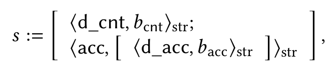

where $b_{\mathrm{cnt}}$ and $b_{\mathrm{acc}}$ represent the register values of d_cnt (in example) and d_acc (in accumulator), respectively. Note that constructs are inductively defined for a module instance declared as acc. We can also obtain the value $b_{\mathrm{acc}}$ from the state $s$ by applying the path $p = [\mathrm{acc}; \mathrm{d\_acc}]$ , i.e., $s[p] = b_{\mathrm{acc}}$ .

To represent bits, we employ a tuple containing the value and size as integers, and the sign as a Boolean $(\mathbb{B})$ . This choice of representation is primarily motivated by utilizing a wide range of lemmas and proof-automation tactics for bits-as-integers in Rocq.

## 3.4 Semantic Transfer Function

We aim to define our formal semantics as a cycle-level transition function that resolves all variable dependencies at once, returning the variable values for the current cycle along with the register states for the next cycle. To this end, we first define the semantic transfer function, which refines the current-cycle state by resolving one additional dependency, while also computing the register updates induced by the current state. The register updates will be read after all variable dependencies are resolved to perform the cycle transition.

We construct semantic transfer functions in a bottom-up manner, from expressions to modules. Also, we utilize simple fail monads (Fail $T$ ), which represent values as either $t \in T$ or fail for unsuccessful evaluations.

Notation: $\mathcal{D}$ (set of declarations); $\mathcal{P}$ (set of hierarchical paths); $S$ (set of states); $S_{\mathrm{u}}$ $(\triangleq S,$ set of state updates); $\mathcal{V}$ $(\triangleq S,$ set of values)

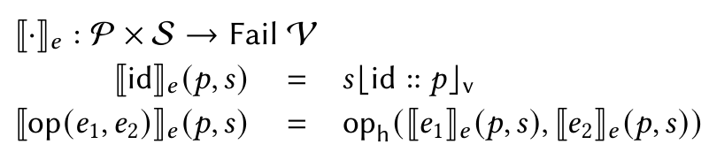

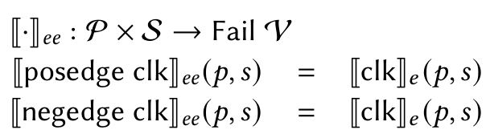

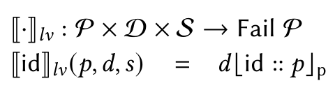

Fig. 3. Semantics for expressions, L-values, and statements (excerpts)

Expressions. Figure 3 presents our formal-semantics excerpts for expressions, L-values, and statements. Denotation of an expression $(\mathbb{I} \cdot \mathbb{I}_e)$ is a function that takes the current evaluation position $(p \in \mathcal{P})$ and state values evaluated so far $(s \in S)$ and returns the evaluated value $(\in \mathcal{V})$ if succeeds. $S$ and $\mathcal{V}$ are both HMaps, i.e., $S = \mathcal{V} = \mathcal{H}$ . At the moment of evaluating an expression, $s$ contains all the values of (1) the parameters and inputs of the module, (2) the current registers, and (3) the wires evaluated so far. Throughout this section, we will simply call $s$ the current state.

## For example in Figure 1

In the first iteration of evaluation, at line 5 (assign d_quad = d_db1 + 2 * d_cnt), the denotation of the right-hand-side expression fails since d_db1 has not been evaluated yet. Once d_db1 is evaluated in later iterations, we will be able to denote this assignment.

To enhance readability, we have chosen not to explicitly show the monadic "bind" operations in Figure 3 to obtain the values of subexpressions. If any subexpression fails to evaluate, the overall evaluation of the expression also fails. We will adopt this convention to other denotations as well.

The denotation of id $(\mathbb{[}\mathrm{id}]\mathbb{]}_e)$ is a retrieval of a value from $s$ , considering the current position $p$ . When $s$ contains multiple values with the same id (but with different positions), we should retrieve the value in the correct variable scope with respect to $p$ . We defined a search function, denoted as $s\lfloor \mathrm{id}:: p\rfloor_{\mathrm{v}}$ , and used it to denote id. The other denotation cases are inductively straightforward, e.g., for $\mathbb{[}\mathrm{op}(e_1,e_2)\mathbb{]}_e$ we denote $e_1$ and $e_2$ first and apply the binary operation defined in HMap $(\mathrm{op}_{\mathrm{h}})$ .

$L$ -values and events. Denotation of an L-value $([\cdot ]_{lv})$ additionally takes declarations evaluated so far $(d\in \mathcal{D})$ , and returns the evaluated path $(\in \mathcal{P})$ if succeeds. $\mathcal{D}$ is also an HMap (i.e., $\mathcal{D} = \mathcal{H}$ ), where each leaf value has no semantic meaning. The denotation of id (as an L-value) then corresponds to a path that can be obtained by searching for the position of id from $d$ , following a similar approach as used for $[\mathrm{id}]_e$ . We defined a similar path-finding function, denoted as $d\lfloor \mathrm{id}::p\rfloor_{\mathrm{p}}$ , for this purpose.

The denotation of an event $(\mathbb{I}[\cdot ]_{ee})$ is defined as evaluating the value of the clock signal clk. Given the top-level clock assumption in §3.1, we set the clock signal to 1 during each clock-triggered state transition. Consequently, event evaluation effectively functions as a simple check for the presence of a clk value within the current scope.

Statements: assignments. Denotation of a statement $(\llbracket \cdot \rrbracket_{st})$ additionally takes the state updates so far within a block $(s_u \in S_u)$ , and returns the updates for wires (or registers) $(\in S_u)$ if succeeds. The determination of whether updates apply to wires or registers is made at the block level, based on the use of either an always_ff or always_comb block.

Notation: $\mathcal{D}_{\mathrm{u}}$ ( $\triangleq$ $\mathcal{D}$ , set of declaration updates); $\mathcal{R}$ (set of registers); $\mathcal{R}_{\mathrm{u}}$ ( $\triangleq$ $\mathcal{R}$ , set of register updates)

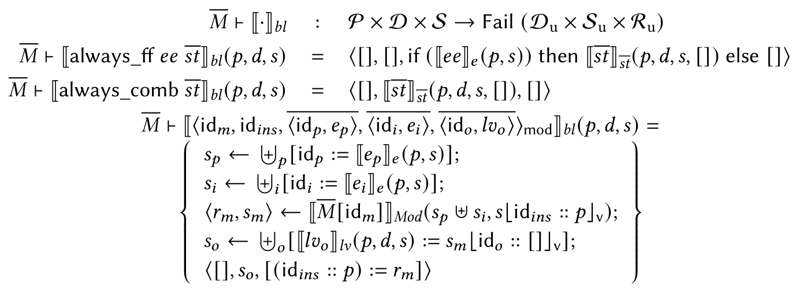

Fig. 4. Semantics for blocks and generate-blocks (excerpts)

A blocking assignment $(\llbracket lv = e\rrbracket_{st})$ updates a state value sequentially within a block, while a nonblocking assignment $(\llbracket lv <= e\rrbracket_{st})$ updates the value concurrently. Therefore, the evaluation of a blocking assignment should use the updated state $(s \uplus s_u)$ , whereas a nonblocking assignment just uses the current state $s$ . Here, $s \uplus s_u$ updates the state $s$ with each path/value pair from $s_u$ . $[p := v]$ constructs an HMap singleton, where $v$ is attached at the last of a path $p$ .

Statements: conditionals (feat. predicated updates). Next, we analyze the case of conditionals. The most intuitive approach to denoting a conditional ( $\llbracket e \rangle$ then $\overline{st_t}$ else $\overline{st_f} \rrbracket_{st}$ ) would be first to evaluate $e$ and to evaluate either $\overline{st_t}$ or $\overline{st_f}$ based on the value of $e$ , formally:

[if (e) then $\overline{st_t}$ else $\overline{st_f}$ ] $_{st}(p,d,s,s_u)$ = if ([e] $_e(p,s))$ then $[\overline{st_t}]$ then $[\overline{st_f}]$ else $[\overline{st_f}]$

However, to enhance the usability of the semantics, we construct state updates per-variable, allowing easy extraction of transitions for specific variables of interest. This approach is particularly useful for proving invariants involving a subset of variables. To support per-variable state updates, we adopt the notion of *predicated updates*, where each entry in the update map is guarded by a predicate indicating whether the corresponding variable should be updated. $(h_1 \uplus \{p\} h_2)$ denotes a predicated update; for example:

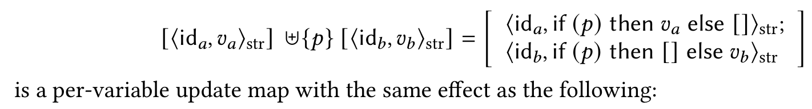

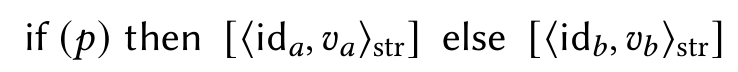

With the denotation of a statement in hand, extending it to a sequence of statements $(\llbracket \cdot \rrbracket_{\overline{st}})$ is straightforward: the state updates are accumulated through evaluating previous statements and are used for the evaluation of the next statement.

Blocks. Figure 4 presents excerpts of the denotations for blocks and generate-blocks. Denotation of a block $(\llbracket \cdot \rrbracket_{bl})$ takes the same arguments $(p,d,s)$ as the one for statements and returns the updates for declarations $(\in \mathcal{D}_{\mathrm{u}})$ , wires $(\in S_{\mathrm{u}})$ , and registers $(\in \mathcal{R}_{\mathrm{u}})$ if succeeds. The state update is

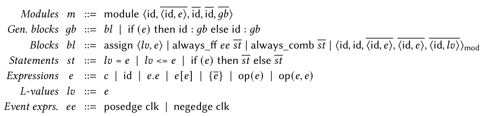

determined to be for either wires or registers at this level by examining the type of the block. For example, if the block is always_comb, the update is for wires.

The denotation of module instances assumes a global argument $\overline{M}$ (i.e., $\overline{M} \vdash [[\cdot]]_{bl}$ ), a map from a module name (ID) to its body, and is declared as follows: (1) Collect all the parameters $(s_p)$ and input values $(s_i)$ to the instance. (2) Obtain the module body $(\overline{M}[\mathrm{id}_m])$ and denote the module using $[\cdot]\mathbb{I}_{Mod}$ defined in §3.5. Then we obtain the instance's output values and register updates. (3) Connect the output values to corresponding wires as updates, resulting in $s_o$ in the denotation.

## For example in Figure 1

The denotation of acc (a module instance in example) is obtained as follows: (1) collect the values of rst_n and d_quad, (2) find the module body of accumulator from $\overline{M}$ and construct its transition function by $[\cdot \cdot \cdot ]_{Mod}$ , (3) apply the input values to the function and obtain the next register state, (4) update the register state for acc.

Generate blocks. Denotation of a generate block $(\mathbb{[}\cdot \mathbb{]}_{gb})$ takes the same arguments $(p,d,s)$ as the one for blocks and returns the updates for declarations $(\in \mathcal{D}_{\mathrm{u}})$ , wires $(\in S_{\mathrm{u}})$ , and registers $(\in \mathcal{R}_{\mathrm{u}})$ . Note that generate block is the first syntax level where the denotation does not fail. For a block $bl$ (as a generate block), the denotation is simply uncovering failures: if the block denotation fails, it returns "no updates" $(\langle [], [], []\rangle)$ . For a conditional generate block (if $(e_c)$ then $\mathrm{id}_t:gb_t$ else $\mathrm{id}_f:gb_f$ ), we first evaluate the condition expression $e_c$ and denote either $gb_t$ or $gb_f$ based on the value of $e_c$ . Also, the current position $p$ should be extended to either $(\mathrm{id}_t::p)$ or $(\mathrm{id}_f::p)$ as the position indeed moves into the sub-generate block. It is also straightforward to inductively extend this denotation to the one for a sequence of generate blocks $(\mathbb{[}\cdot \mathbb{]}_{gb})$ .

Modules. Finally, we define the semantic transfer function for a module. Presented in Figure 5, denotation of a module $(\llbracket \cdot \rrbracket_{mod})$ takes the declarations and states evaluated so far $(d \in \mathcal{D}$ and $s \in S)$ , and returns the next declarations/states $(\in \mathcal{D} \times S)$ and the register updates $(\in \mathcal{R}_{\mathrm{u}})$ . In essence, this denotation derives additional declarations/states based on the provided arguments.

## 3.5 State-Transition Function

Now we define the state-transition function of a module, using the least fixed point $(\llbracket \cdot \rrbracket_{mod}^{\infty})$ with respect to the declarations and wire states evaluated so far. Presented in Figure 5, $\llbracket m\rrbracket_{mod}^{\infty}$ is defined by repeatedly applying the semantic transfer function $(\llbracket m\rrbracket_{mod})$ until it reaches the fixed point, which intuitively means that no further dependencies remain unresolved. More formally, in Rocq, $\llbracket \cdot \rrbracket_{mod}^{\infty}$ is defined using a subset type that admits only fixed-point functions. Consequently, to define and use the function, the user must provide a proof that the fixpoint computation terminates, which can typically be discharged trivially by a single automated tactic.

Fig. 6. A module that joins the outputs of two submodules using the valid/ready protocol, producing output only when both sources are valid.

## For example in Figure 1

Assuming rst_n = 1 (i.e., after the reset), it is required to apply the semantic-transfer function twice to obtain the least fixed point ([example]mod); the wire updates are illustrated as follows:

The state-update function $\llbracket \cdot \rrbracket_{Mod}$ is constructed directly from $\llbracket \cdot \rrbracket_{mod}^{\infty}$ : it takes the input values $(s_i)$ and the current register values $(s_r)$ , and returns register updates $(\in \mathcal{R}_{\mathrm{u}})$ and output values $(\in S)$ . Here, $\llbracket m \rrbracket_{mod}^{\infty}$ is used to derive the wire states and the register updates $(dsr)$ . Using $\llbracket \cdot \rrbracket_{Mod}$ , we can easily define the state-transition function $\mathcal{T}_m: S \times \mathcal{R} \rightarrow \mathcal{R} \times S$ :

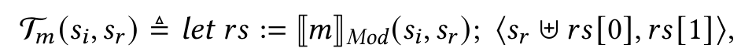

where the current register state $(s_r)$ and the updates $(rs[0])$ are merged to obtain the next state.

Our semantics is modular at the level of state-update functions $\llbracket \cdot \rrbracket_{Mod}$ . Specifically, the state-update function of a submodule is compositionally employed to define that of its parent module (§3.4). As discussed in §2.3, this approach facilitates modular verification by enabling the abstraction of a submodule's state-update function for use in verifying the parent module. We demonstrate this approach in §5.

Partial evaluation. As a side benefit, we can further optimize the state-transition function with partial evaluation. For example, the denotation of an expression “a || b” can be partially evaluated $(\rightsquigarrow)$ as follows:

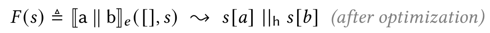

Normally, the original function $F(s)$ evaluates when the argument $s$ is given to the function. We can simplify this function by partially pre-evaluating it as much as possible. Consequently, the resulting function does not involve any syntactic components but just the manipulation of values, e.g., the logical OR operation $||_{\mathsf{h}}$ for HMaps. To perform partial evaluation, we employ the vm_compute tactic in Rocq [25, 48], which evaluates terms more efficiently than other evaluation tactics.

Comparison with assignments sorting. While we employ a least fixed point (LFP) approach to handle variable dependencies, an alternative method targeting flat designs (i.e., designs without submodules) was proposed by Lööw et al. [34]. Their Verilog semantics applies a sorting algorithm prior to each transition, ordering the always_comb blocks to ensure that no process writes to a variable previously read by another. If multiple valid orders exist, the semantics selects one arbitrarily; if no valid order exists, the design is deemed unsupported.

Although their sorting method and our LFP approach are mostly equivalent, we observe that the LFP approach is more general, as it accommodates designs lacking a valid dependency order among blocks. This generality is essential for submodule abstractions, since when a submodule's denotation is a single transition—as in our approach—the transition often introduces cyclic dependencies with other assignments, even in the absence of actual combinational loops. For instance, Figure 6 shows a module implementing a valid-ready protocol that waits for both submodules' outputs to be valid before producing a combined output. Because the two assignments and two module instantiations in lines 8 to 11 form a cyclic dependency, the sorting-based approach cannot handle the design. In contrast, our LFP semantics evaluates the code seamlessly unless a true combinational loop is present, by reapplying each submodule transition until all variables are evaluated.

## 4 Equivalence Between The Standard and Our Semantics

We formally prove the correctness of our semantics (§3) by demonstrating its equivalence to the standard scheduling semantics for the considered, synthesizable subset of Verilog (§3.1). To this end, we formalize the scheduling semantics for the subset (§4.1), and state and prove the equivalence theorem (§4.2).

## 4.1 Formal Scheduling Semantics for Synthesizable Verilog Modules

Processes and events. The scheduling semantics handles state transitions of processes driven by events. We consider only the types of events generated from the considered, synthesizable subset of Verilog (§3.1). In synthesizable Verilog modules, processes encompass always blocks and continuous assignments (assign $s = v$ ). Processes run concurrently by generating and executing (handling) events. For events, there are three types:

- An update event is generated when an assignment is evaluated. An assignment can be either by the one within an always block or by assign. Execution of an update event updates the state and generates evaluation events for processes that read the updated variable.

- An evaluation event is generated when an update event is executed. Execution of an evaluation event may generate update events for assignments within the evaluated block.

- A clock event is generated for each tick of the (global) clock. When executed, it may generate evaluation events for the processes sensitive to clock edging (e.g., always @(posedge clk)).

Note that the state in the standard contains all the wire values along with the register values. In contrast, our semantics defines the state as containing only the register values.

## For example in Figure 1

(1) In the example module, an assignment to d_dbl at line 8 generates an evaluation event for the continuous assignment at line 5 (assign d_quad = ..), since the right-hand-side of the assignment reads d_dbl as an operand. (2) The evaluation event of the always block at line 12 can be generated only by executing the clock event for clk.

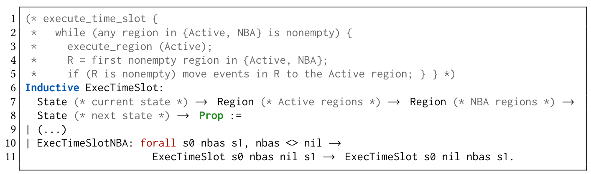

Fig. 7. Execution of the Active and NBA regions

Time slots. As discussed in §2.2, the scheduling semantics defines state transitions logically by using time slots. For a given time, a time slot is defined as the execution and removal of all currently scheduled events. Once no events remain, the transition steps to the next nonempty time slot.

In synthesizable Verilog modules, two types of events can be scheduled to the top-level module: clock events and input-value update events. A clock event is scheduled for each clock tick, while update events are scheduled whenever input values change. In this paper, we assume that clock events and input-value update events are not scheduled together within the same time slot. Mixing these events in a single slot would cause the two event executions to interleave, potentially resulting in some registers updating with old input values while others receive new ones—a scenario that would not occur in practice.4

Event scheduling and state-transition steps. For the current time slot, the scheduling semantics first divides the currently scheduled events into several ordered regions. When an event is generated, it is added to exactly one of these event regions. By maintaining these ordered regions, the scheduling semantics enforces a fixed execution order between certain types of events.

The standard designates 17 event regions. We observe that for synthesizable designs, all events are added to either the Active or NBA (nonblocking assignment) region. Update events from blocking assignments are placed in the Active region, while those from nonblocking assignments go to the NBA region. Other regions are reserved for events from non-synthesizable syntactic components: (1) Pre- and Post- regions for enabling $C / C++$ function invocation, (2) Preponed, Observed, and Reactive regions for concurrent assertions or program blocks, and (3) Inactive region for handling zero-delay controls.

The standard describes how events in each region should be handled by providing the simulation reference algorithm. Figure 7 presents the algorithm adapted for synthesizable designs (noted in the comments) and our formalization in Rocq. execute_region handles a single region: it nondeterministically picks an event from the region and executes it, which might generate additional events; the execution continues until the region is empty. execute_time_slot handles all the regions in a time slot. For example, we can see that ExecTimeSlotNBA, one of the constructors of ExecTimeSlot, faithfully performs the step "move events in R to the Active region" from the algorithm.

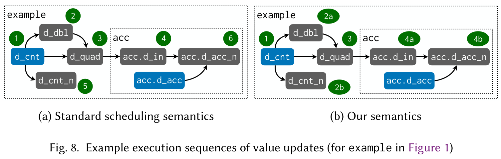

## 4.2 Equivalence Proof

We provide a high-level intuition for the equivalence proof between the scheduling semantics and our own. The proof proceeds by establishing mutual inclusion: our semantics both includes (is at least as relaxed as) and is included by (is at least as strict as) the scheduling semantics.

Our semantics is at least as strict. We prove that every execution in our semantics can be simulated by the standard scheduling semantics. This is mostly straightforward, as our semantics impose stricter constraints on the block execution order. Specifically, we prove that our semantics exhibits a possible execution within the standard's nondeterministic and global scheduling.

Our semantics is deterministic, essentially applying the state transfer function iteratively via LFP. In each round of updates, our semantics incorporates all possible updates based on value-update dependencies. It is evident that this constitutes a possible scheduling in the nondeterministic standard semantics.

Our semantics is also modular, wherein the state-transition function of a module determines the next state by orchestrating that of its submodule instances. Conversely, the standard semantics employs global scheduling, treating submodules as inlined and handling input and output ports between modules simply as assignments (§2.3). Given that a submodule is itself a module, we can inductively conclude that the transition effect of a module is equivalent to some permutation of submodule block execution permitted by the scheduling semantics.

This is illustrated in Figure 8. Our semantics can be interpreted as computing the effect of one particular order permitted by the standard semantics. When d_cnt updates (order 1), d_db1 and d_cnt_n update next (orders 2a and 2b), followed by d_quad (order 3), and then acc.d_in and acc.d_acc_n (orders 4a and 4b).

Our semantics is at least as relaxed. The other direction of the inclusion is proven by the fact that the standard scheduling semantics is confluent for our target Verilog subset, i.e., given the currently scheduled events at the top level, the resulting state is the same regardless of the event-execution sequence, formally stated as follows:

LEMMA 4.1 (CONFLUENCE). $\forall s0$ acts nbas s1 s2,

ExecTimeSlot s0 acts nbas $s1 \rightarrow$ ExecTimeSlot s0 acts nbas $s2 \rightarrow s1 = s2$ .

Proof Sketch. Intuitively, Figure 8 illustrates that the value-update dependencies among variables form a topological order, which already justifies that the resulting updated states must be the same, regardless of the order of updates. For instance, the updated value of d_cnt_n depends only on the updated value of d_cnt, regardless of the sequence in which d_cnt_n is updated.

Having discussed the equivalence of state transitions between the standard and our semantics intuitively, we will now present formal statements and proofs.

Aligning the state transitions. As discussed in §4.1, the standard semantics deals with states that include both wire and register values. In contrast, our state-transition function $(\mathcal{T}_m)$ only provides transitions for the register state. However, the construction of the state transition involves evaluating the current wire states with respect to the current inputs and register state $\left(\left[\cdot \right]\right)_{mod}^{\infty}$ . To align the states between the standard semantics and ours, we define the following:

Definition stateOf (inputs: State) (regs: Regs): State := $\llbracket m\rrbracket_{\mathrm{mod}}^{\infty}([],\mathrm{inputs}\uplus$ regs)[1].

Definition trsF (inputs: State) (regs: Regs): Regs := $\mathcal{T}_m$ (inputs,regs)[0].

stateOf constructs a state used in the standard for given inputs and register values;TRSF is a state-transition function for registers.

As discussed in §4.1, the standard semantics can handle two types of events: clock events and input-value update events. We explicitly define these two state transitions—one driven by the clock (TrsC) and another by the inputs (TrsI)—to compare directly with our semantics:

Definition TrsC (s0 s1: State): Prop := ExecTimeSlot s0 [Event_clk] nil s1.

Definition TrsI (s0 ins s1: State): Prop := ExecTimeSlot s0 [EventUpdate ins] nil s1.

The equivalence proof. Since trsF as a function maintains a fixed event-execution order, we can easily prove that trsF is at least as restrictive as ExecTimeSlot:

LEMMA 4.2. (1) $\forall i0$ i1 r, TrsI(stateOf i0 r) i1(stateOf i1 r).

(2) $\forall$ ins $r0$ r1, trsF ins $r0 = r1 \rightarrow TrsC$ (stateOf ins $r0$ ) (stateOf ins $r1$ ).

(1) represents the case where the state transition is performed by the input-value updates: in this case, we can simply reconstruct the state with the new input values (i1) while retaining the register state (r). (2) represents the state transition by the clock event, updating the register values.

Next, by simply applying Lemma 4.2 and Lemma 4.1, we easily prove the implication in the other direction:

LEMMA 4.3. (1) $\forall i0$ i1 r s1, TrsI(stateOf i0 r) i1 s1 $\rightarrow$ s1 = stateOf i1 r.

(2) $\forall$ ins $r0$ s1, TrsC(stateOf ins $r0$ ) $s1 \rightarrow s1 =$ stateOfins(trsFins $r0$ ).

Proof. For (1), by the definition of $\mathsf{TrsI}$ and Lemma 4.1, we conclude that $\mathsf{TrsI}$ is also confluent. Applying this confluence along with (1) in Lemma 4.2, we immediately obtain $s_1 = \text{stateOf i1 r}$ . The proof of (2) follows in a similar manner.

Finally, the equivalence is proven straightforwardly by applying Lemma 4.2 and Lemma 4.3:

THEOREM 4.4 (EQUIVALENCE). $\forall$ ins1 $r\emptyset$ r1,TRS F ins1 $r\emptyset = r1\leftrightarrow$

$\exists$ ins0 s, ExecTimeSlot(stateOfins0r0)[EventUpdateins1]nils

ExecTimeSlot s [Event_clk] nil (stateOf ins1 r1).

Note that a single transition step by trsF corresponds to two steps by ExecTimeSlot: first by the input updates (to ins1) and then by the clock tick. This correspondence arises because the standard semantics are logically timed, whereas our transition function is physically timed. As discussed in §4.1, the practical assumption here is that the inputs change between clock ticks. Our transition function handles state transitions first through the input-value updates, followed by the clock tick.

## 5 Modular Verification of a Pipelined RISC-V Processor

We demonstrate the practical application of our semantics through a modular, foundational verification of a pipelined processor. We review interaction trees (ITrees) [53] ( $\S 5.1$ ), which we employ to extend our cycle-level transition function into multi-cycle trace semantics ( $\S 5.2$ ). We lift the formal RISC-V specification due to Bourgeat et al. [5] to the ITree level and define the verification

goal as a behavioral refinement between these two ITrees (§5.3). We present a pipelined processor implementation in Verilog (§5.4). We apply a well-established simulation technique for a modular proof of total correctness, encompassing both functional correctness and progress guarantees (§5.5).

## 5.1 Background: Interaction Trees

ITree [53] is a program-like data structure that represents program behaviors interacting with their environments, equipped with equational theories and compositionality. An ITree with an event type E : Type $\rightarrow$ Type and a result type R : Type is defined coinductively as follows:

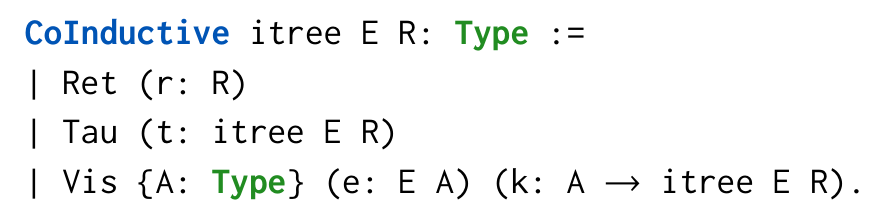

Here, Ret r denotes a simple program that immediately returns the value r; Tau t represents a program that takes a silent step and proceeds with the tree t; and Vis e k is a program that triggers an interaction event e : E A, receives a value a : A from the environment, and continues with k a.

Since it tree E is a monad, we can use the monad notation $\mathsf{x}\gets \mathsf{i};\mathsf{k}$ to bind a variable. Additionally, ITrees provide the trigger operation, which allows the Vis constructor to be used within monadic contexts, i.e., $(\mathsf{x}\gets$ trigger e; k x) is equivalent to Vis e (fun $\mathsf{x}\Rightarrow \mathsf{k}\mathsf{x})$

Refinement. We use behavioral refinement (behavior inclusion) as our correctness criterion. Following Xia et al. [53] and Cho et al. [8], we interpret the behavior of an ITree as a set of possible traces, where each trace represents a sequence of observable events. Here, we present a simplified version of the trace definitions from Cho et al. [8].

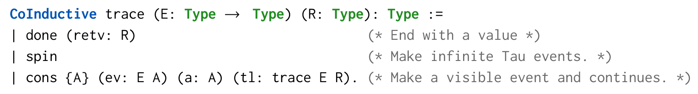

Using the definition of behaviors, we define behavioral refinement between ITrees:

It is straightforward to show that behavioral refinement is reflexive and transitive.

## 5.2 Verilog Module Behavior in ITree

Event and return types. Since a Verilog module does not produce a final value, we set R to $\emptyset$ . There are two event types (E): Input and Output. Each cycle consists of an Input event that reads from the input wires and an Output event that writes to the output wires.

Initial states. For simplicity, we assume that the initial state of a module is defined as the resulting state when the reset signal rst_n is set to 0. Formally:

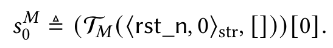

Module ITrees. Accordingly, we define the ITree for a Verilog module $M$ as follows:

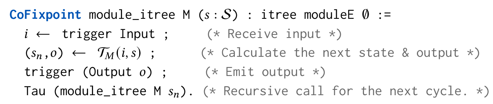

Definition $\llbracket M\rrbracket$ : itree moduleE $\emptyset :=$ module_iritree $M$ $s_0^M$

Filtering inputs and outputs. Hardware designs often require multiple cycles to complete a task. While the task is being processed, hardware typically does not receive external inputs and sets the validity flag to false to indicate invalid outputs. To simplify events of these designs, we propose a filter_io function that transforms a module ITree by (1) removing all the input events by fixing the input value, and (2) filtering out invalid outputs. This is done by using an ITree interpreter interp H provided by the ITree library, which intuitively replaces all trigger e with H e.

Here, filter_io receives a fixed-input value i and an output-validity predicate P. All input events are replaced with value i, while the output events not matching the predicate P are removed. We use notation $[I]_{in=s,out|P}$ for filter_io s P I and $[M]_{in=s,out|P}$ for filter_io s P $[M]$ .

Determinism. We formalize the determinism theorem for ITree modules:

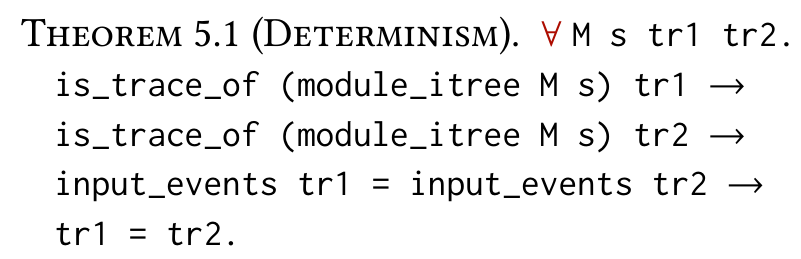

Here, input_events is a coinductive filter function that extracts the input stream from a trace. This theorem asserts that for any Verilog module $M$ , a given input stream uniquely determines its trace. The proof of this theorem follows directly from the fact that the single-cycle transition function, $\mathcal{T}_M$ , is a pure Coq function that deterministically maps (inputs, registers) to (regs', outputs).

Modularity. While our semantics offers modularity at the state-update function level, extending this modularity to ITrees for semantic composition of module ITrees presents a significant challenge. This difficulty stems from inherent circular input/output dependencies. Specifically, a submodule's outputs serve as inputs to its parent, and conversely, the parent's outputs act as inputs to the submodule. This mutual dependency precludes a clear sequential execution order for the two ITrees, rendering ITree composition nontrivial. We view the formalization of ITree-level modularity as an interesting avenue for future work.

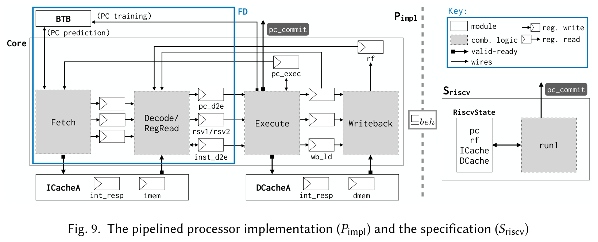

## 5.3 Formal Specification of RISC-V

Our correctness condition is based on the mechanized formal specification of RISC-V [5]. We select the 32-bit deterministic specification without extensions, implementing the RV32I ISA [52], excluding FENCE (memory model), ECALL (environment calls), and EBREAK (breakpoints) instructions. Additionally, we simplify the spec by separating the data and instruction caches.

The formal specification provides a function, run1: RiscvState $\rightarrow$ RiscvState, $^7$ simulating the execution of a single CPU instruction. Using this function and a given initial state $s_0^R$ , we define the specification ITree $S_{\mathrm{riscv}}$ as follows:

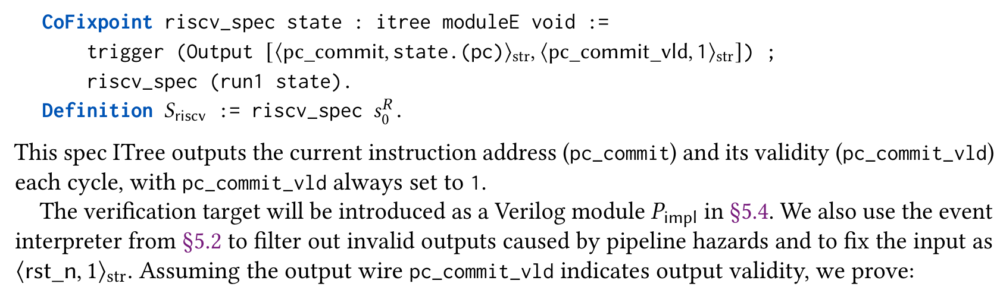

The verification target will be introduced as a Verilog module $P_{\mathrm{impl}}$ in §5.4. We also use the event interpreter from §5.2 to filter out invalid outputs caused by pipeline hazards and to fix the input as $\langle \mathrm{rst\_n}, 1 \rangle_{\mathrm{str}}$ . Assuming the output wire pc_commit_vld indicates output validity, we prove:

Progress guarantee. The specification $S_{\mathrm{riscv}}$ emits only visible events and thus does not produce a spinning trace with an infinite sequence of Tau events. As such, our verification goal enforces progress in the implementation: it should eventually produce a visible event as well.

## 5.4 Pipelined Processor Implementation

Figure 9 illustrates $P_{\mathrm{impl}}$ , our pipelined processor implemented in Verilog. It is composed of three main modules: Core, ICacheA, and DCacheA, with a total of around 500 lines of code. Core contains the processor pipeline consisting of four stages. The first two stages—Fetch and Decode—interact with the instruction cache ICacheA, while the latter two—Execute and Writeback—interact with the data cache DCacheA. To demonstrate modular verification, we encapsulate the first two "frontend" stages along with the branch target buffer (BTB) [40] into a submodule named FD, highlighted as

a blue dotted square. Between any two stages, there are pipeline registers that store data to be transferred from the previous stage to the next stage. We elaborate on key design aspects below.

Atomic caches. Our processor utilizes an instruction cache (ICacheA) and a data cache (DCacheA) to fetch instructions and to load/store data, respectively. These caches are atomic in the sense that they do not allow any additional requests while processing a specific request until the corresponding response comes out. In our case study, we implemented each cache in a conventional way: a data array alongside a register called int_resp that temporarily stores the response data. Many FPGA synthesis tools convert this design into an atomic memory called a Block RAM (BRAM).

Core pipeline. The core has a conventional in-order four-stage pipeline. The Fetch logic fetches instructions from ICacheA and utilizes a branch target buffer to predict the next PC.

The Decode logic extracts information from the instruction and also reads the values of the source registers (srv1 and rsv2) from the register file (rf). At register reads, data hazard [26], a well-known challenge in designing a pipelined processor, may happen, and we partially resolve it by bypassing the register value calculated after the Execute stage.

The Execute logic executes the decoded instruction along with the corresponding source-register values. It maintains a register pc_exec, which always holds the correct PC for execution, and thus compares pc_exec with the PC from Decode (pc_d2e) to determine whether to proceed with the execution or not. Upon successful execution, Execute sets the module-level output pc_commit to the PC value of the executed instruction.

The final Writeback logic writes data back to the register file rf. It handles two cases: one involving the executed value from Execute and the other involving the load value from DCacheA. The logic wb_ld determines which case the write operation corresponds to.

## 5.5 Behavioral Refinement Between $P_{\mathrm{impl}}$ and $S_{\mathrm{riscv}}$

The high-level structure of the proof is as follows. We first define a specification of the frontend module FD's transition function $\llbracket FD\rrbracket_{Mod}$ , which abstracts both the properties of the module's outputs and the invariant maintained by its internal state. Since our semantics is modular (i.e., module transitions are defined compositionally from submodule transitions), we can directly use the frontend specification to reason about the rest of the Core. Specifically, we use the output predicate of the frontend specification to show that all backend execution steps are simulated by $S_{\mathrm{riscv}}$ , completing the proof. We elaborate on key proof steps below.

Verifying the frontend specification. The frontend module receives the caches i_mem and d_mem as input, predicts the next PC, and outputs the fetched instruction and register values. Since its output is passed to the backend only when the validity flag d2e_v1d is set, we define the output specification to express that the output values correspond to the predicted PC when d2e_v1d is true. For example, the fetched instruction inst_d2e should match the instruction at pc_d2e in i_mem. Formally, the output predicate $P$ for the frontend is defined as follows:

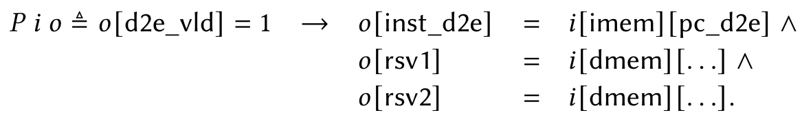

While this abstraction captures the necessary information for the backend, proving the output predicate requires including an invariant over the frontend state in the specification. We define a state invariant Inv for the frontend state $s_{\mathrm{f}}$ and input $i$ , which asserts that the pipeline registers storing the Fetch-stage output are consistent with the predicted PC, in a manner analogous to $P$ .

Using this invariant, the frontend specification is defined as follows:

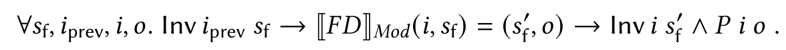

This specification is straightforwardly proven from the wire definitions of FD.

Using the frontend specification. To enable the use of the output predicate proof in the backend, we must show that the state output of $\llbracket FD\rrbracket_{Mod}$ is used as the state input in the next cycle. This follows immediately, as no backend block can modify the frontend submodule state embedded under the submodule ID. We therefore directly use the predicate $P i o$ for the remainder of the proof.

Verifying the backend by simulation. We now prove the behavioral refinement of the backend by employing a well-established simulation proof technique, which allows per-step reasoning of execution. Specifically, we use the FreeSim [8] library that enables simulation proofs with ITrees. With FreeSim, the proof of refinement between two ITrees is conducted by defining a simulation relation $(\mathcal{Z}) \subseteq$ itree ER $\times$ itree ER that satisfies the following obligations:

(1) If $(\text{Vis } e k_i) \precsim s$ , then $s$ can reduce to $\text{Vis } e k_s$ , where $\forall a, (k_i a) \precsim (k_s a)$ .

(2) If $(\operatorname{Ret} r) \preceq s$ , then $s$ can also reduce to $\operatorname{Ret} r$ .

(3) If $(\text{Tau } t) \precsim s$ , then $t \precsim s$ .

Here, the term "reduce" refers to executing an ITree until a visible event is emitted or execution terminates, ignoring silent Tau events. Intuitively, $I \preceq S$ (read $S$ simulates $I$ ) indicates that for each step taken by $I$ , $S$ can perform a corresponding step that produces the same events while preserving the simulation relation. Since the specification can generate the same visible events as the implementation, it is straightforward to prove that every trace of $I$ can be reproduced by $S$ , which is formalized in the FreeSim library as the following adequacy theorem:

THEOREM 5.2 (ADEQUACY). If a simulation relation exists between $I$ and $S$ , then $I \subseteq_{\text{beh}} S$ holds.

Constructing the simulation relation. We construct $(\preceq)$ in a bottom-up fashion, beginning with the relation for equivalent bits. Two bits representations $w_{1}$ and $w_{2}$ are related $(w_{1} \preceq w_{2})$ iff their mathematical integer values are equal. The relations for memory and register values are all naturally defined by lifting this relation for bits.

The relation between $s^{\mathrm{impl}} \in S$ and $s^{\mathrm{spec}} \in \mathrm{RiscvState}$ requires additional reasoning. Since the processor implementation is pipelined, we must define which PC/instruction we designate as the current ones, so they can be mapped to their counterparts in the spec. In our proof, we chose the ones around the Execute stage—pc_exec for the PC and inst_d2e for the instruction. The intuition behind this decision is that the Execute stage should execute an instruction only if pc_d2e matches pc_exec (i.e., PC prediction is correct), indicating that inst_d2e is the instruction fetched from the instruction cache with pc_exec as the memory address. Formally, the state relation $(\preceq)$ is defined as follows:

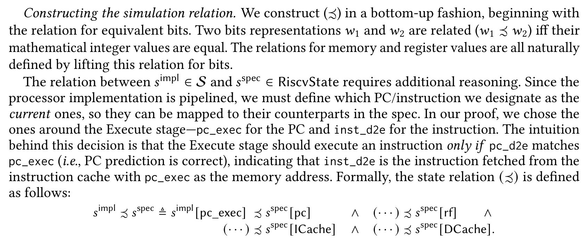

The relations for memory and register file involve case analyses on the pipeline status, since there could be temporal inequivalence while the Writeback stage updates $s^{\mathrm{impl}}$ . In this paper, we omit their definitions for brevity and focus on PC for the rest of the proof.

Finally, we define the simulation relation $(\preceq)$ between ITrees by lifting the state relation:

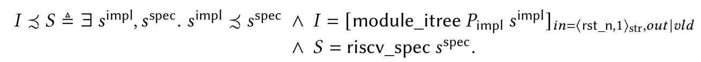

Then it is straightforward that $(\preceq)$ relates the initial ITrees:

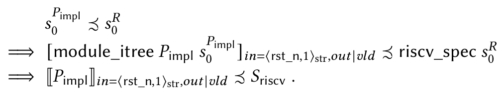

(by the state relation definition)

(by the simulation relation definition)

(by the ITree definitions)

Proving simulation. Now we prove that $(\preceq)$ is a simulation relation. We start by assuming $I \preceq S$ , which implies that $I$ is a module ITree with a state $s^{\mathrm{impl}}$ , $S$ is a specification with a state $s^{\mathrm{spec}}$ , and $s^{\mathrm{impl}} \preceq s^{\mathrm{spec}}$ . We need to prove that every step of $I$ can be simulated by $S$ , resulting in the next states still related by the state relation $(\preceq)$ . To this end, we perform a case analysis on pc_commit_vld.

If pc_commit_vld = 1, then the execution has occurred; thus pc_d2e is equal to pc_exec. Using the frontend output predicate and the precondition that the execution has occurred, we prove that the implementation and the spec execute the same instruction as below:

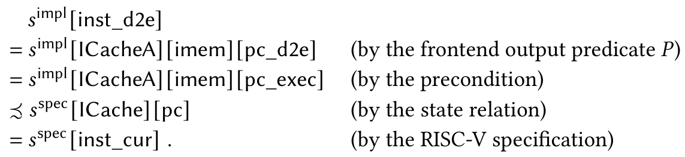

We do a similar reasoning to prove that the fetched registers rsv1 and rsv2 in the implementation and spec are also related. With this, proving the simulation relation becomes straightforward, as both the implementation and spec update their PCs with the same instruction and register values.

If pc_commit_vld is 0, there is no execution, and the pc_exec stays the same. The output event is filtered by vld, making the implementation take a silent Tau step. Since the spec does not move for a Tau step, $s^{\mathrm{impl}}[\mathrm{pc\_exec}]$ also stays the same, proving that the simulation relation holds.

Ensuring progress. FreeSim simulation ensures total correctness, requiring proof that the implementation will eventually produce a visible event that can be simulated by $S_{\mathrm{riscv}}$ . Since our implementation generates a visible event upon instruction execution, it is sufficient to prove that the processor eventually execute an instruction. Here, we present the high-level proof ideas.

We first interpret $P_{\mathrm{impl}}$ execution as multiple tasks each having their own PC value simultaneously advancing in a pipeline, and prove that every task eventually moves forward. This follows from the two properties directly provable from the wire definitions: (1) A task either advances one stage or remains in place. (2) For any task, if there are no tasks in the subsequent stages, it must advance.

It naturally follows that the Execute stage eventually receives a task. We consider the first task it receives. (1) If the task has $\mathsf{PC} = \mathsf{pc\_exec}$ , the Execute stage successfully executes the instruction matching the PC. (2) Otherwise, the Execute stage executes the PC misprediction handling logic to insert a new task with $\mathsf{PC} = \mathsf{pc\_exec}$ into the Fetch stage. The inserted task will eventually reach the Execute stage, leading to instruction execution and completing the proof.

During this proof, we identified and rectified a liveness bug in our processor implementation, which reinforces the reliability of verification using our proposed semantics and FreeSim.

## 6 Evaluation

## 6.1 Comparison of Verification Frameworks for Verilog

Table 1 compares our framework with four other deductive-verification frameworks for Verilog; Gordon et al. [23, 24, 44], Slobodova et al. [15, 21, 28, 47], Bidmeshki et al. [3, 4], and Loow et al. [16, 27, 31, 32, 34, 36]. Each framework can reason about Verilog designs by either compiling designs described in its own HDL to Verilog ("Translates to" in the figure) or by translating Verilog

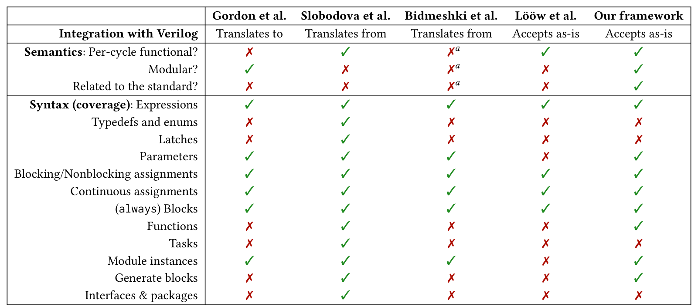

designs into its respective HDL ("Translates from"). We have categorized our evaluation criteria into two parts: semantic features and syntactic coverage.

Semantic features. We assess whether target semantics supports per-cycle functional evaluation, modular reasoning, and is formally related to the standard semantics [2] via equivalence proofs or verified compilation. Crucially, only ours provide semantic equivalence to the standard.

Gordon et al. employ a workflow that designs and verifies hardware components using HOL functions (thus shallowly embedded), followed by conversion into Verilog. Using this framework, an ARM6 microarchitecture has been formally verified [19]. Although its semantics are defined modularly, the translation remains unverified, placing it within the TCB.

Slobodova et al. take Verilog modules and convert them to its netlist-level HDL called SVL, enabling the successful verification of industry-level hardware components such as integer multipliers [47] and microprocessors [15, 21, 22]. However, their semantics is not modular—Verilog module hierarchies are flattened—and it also lacks a formal connection to the Verilog semantics, i.e., the conversion to SVL is unverified.

Bidmeshki et al. present VeriCoq, a converter from Verilog to Rocq that automates part of the proof-carrying hardware intellectual property (PCHIP) framework [33]. It translates Verilog code into Rocq definitions by mapping each syntactic construct to a corresponding Rocq representation in a one-to-one manner. This tool has been used to develop a framework for verifying whether a Verilog design complies with specified information flow policies [3]. However, VeriCoq performs only syntactic translation and lacks a formal semantics for the generated Rocq code, leaving the interpretation of hardware behavior to the user.

Lööw et al. also support hardware design using HOL functions and enables verified compilation to Verilog. For compilation verification, they define formal semantics for a synthesizable, synchronous subset of Verilog as a cycle-transition function, similar to our approach. In contrast to our use of least fixed points, their semantics rely on a sorting algorithm that orders combinational blocks by variable dependencies, selecting an arbitrary permutation when multiple valid orders exist. However, they do not verify that the chosen order soundly captures all behaviors permitted by the standard's nondeterministic block execution, leaving this assumption within the TCB. Their semantics also lack modularity: hardware must be represented as a single flattened Verilog module.

We argue that extending the sorting-based approach to modular semantics is nontrivial, as discussed in §3.5.

Syntactic coverage. We assess coverage at a high level, considering elements such as expressions and blocks. A syntactic component is marked as covered $(\checkmark)$ if the target framework supports at least part of it; otherwise, it is marked as not covered $(\times)$ , indicating a lack of any coverage. Our framework currently provides broader support than the others, with the exception of the work by Slobodova et al., which appears to cover nearly all Verilog components.

## 6.2 Comparison of Processor-Verification Case Studies

We compare our case study with other processor-verification efforts that have employed deductive verification, specifically Kami and Silver-Pi.

Comparison with Kami. Kami [11, 17] is a Rocq-embedded framework for verifying hardware modules described in the Kami rule-based HDL. Using the Kami framework, the correctness of a pipelined RISC-V processor has been formally proven. Their processor closely resembles our case-study processor: both feature a four-stage pipeline and include a branch target buffer (BTB) connected to the Fetch stage. In terms of data-hazard handling, the Kami processor is less optimized than ours: it only supports stalling and lacks value bypassing.

Kami's formal semantics is defined in a relational style, posing a major bottleneck in verification. When proving the invariants required for processor correctness, $\sim 55\%$ of the proof-checking time was spent deducing the relational semantics (182 out of 330 seconds, measured using the Ltac profiler [50]).

The total time to machine-check the invariant and correctness proof is 778 seconds, whereas our proof takes only 148 seconds, which is $\sim 5.3 \times$ faster. (Experiments were conducted using Rocq 8.18 on an Apple M2 Pro SoC with 16 GB RAM.) While the comparison may not be entirely fair due to differences in language and verification methodology, we believe it still provides a meaningful indication of our framework's efficiency.

Comparison with Silver-Pi. Another comparison target is the Silver-Pi processor [16], verified against the custom Silver ISA as a specification. The processor is developed using a proof-producing verified library and compiler [31, 36] in the HOL theorem prover, later translated to Verilog. It is pipelined with five stages but uses a naive branch predictor (that always predicts $\mathsf{pc} + 4$ ) and only supports stalling for data hazards, similar to Kami. Since the verification is performed using a different theorem prover, we believe direct comparisons of proof-checking time would not yield meaningful insights.

## 7 Related and Future Work

Formal semantics of Verilog. Several approaches have been developed to formalize the scheduling semantics described in the SystemVerilog standard [2]. Zhu et al. [54, 55] derived both operational and denotational semantics from what is called "algebraic semantics", but their scope is limited to a restricted subset of Verilog, excluding features like assignments. Meredith et al. [39] employed the K framework to define a comprehensive and executable operational semantics of Verilog based on rewriting logic. Chen et al. [7] presented "The Essence of Verilog," one of the most comprehensive formal semantics to date. Nevertheless, these semantics have not been used for deductive verification. In contrast, we use our formal semantics to formally verify a RISC-V processor.

There has been a known defect in the standard scheduling semantics, allowing a scenario where a process is triggered by an update event generated by an intermediate update value in a combinational-logic block but ignores the final update event, thus failing to read the final value.

Recent successes have focused on addressing this issue [31, 35, 36], achieving a rigorous operational semantics. We incorporated their solution when formalizing the standard scheduling semantics.

Deductive verification of Verilog designs. We compared deductive-verification frameworks for Verilog designs with our framework in §6.

Deductive verification of non-Verilog designs. There have been successful approaches to verifying hardware described in rule-based high-level HDLs. Kami [11] is a Rocq-embedded framework for verifying hardware components described in the Kami rule-based HDL, where we have provided a comparative evaluation with their RISC-V processor-verification case study in §6.2.

Koika [6] is another Rocq-embedded framework, further equipped with a verified compiler that translates its rule-based HDL into RTL circuitry. Using Koika, a hardware enclave has been designed and verified, ensuring strong timing isolation [30]. Currently, the Koika toolchain relies on an unverified translation from its compiler target language (called "minimal RTL") to Verilog. We believe that our Verilog semantics can enable efficient verification of this translation, thereby minimizing the TCB of their toolchain.

There have also been approaches to verifying hardware at the circuit level. CoCEC [29] is a combinational-circuit equivalence checker implemented in Rocq. It features a simple gate-level HDL, and circuit equivalence is proven automatically using custom tactics. When the proof succeeds, it yields a formal equivalence proof; when it fails, it can produce a counterexample. $\lambda \pi$ -Ware [41] is a gate-level HDL embedded in Agda. It enables users to specify and verify circuits by leveraging Agda's dependent type system, supporting proofs of refinement and behavioral equivalence. As a case study, a small ALU is specified at a high level and then refined into a concrete gate-level implementation, with formal proofs of equivalence at each step. The two languages introduced above lack sufficient abstraction to enable scalable design and verification; to our knowledge, no case studies involving multiple modules have been conducted for these languages. Moreover, they are not directly compatible with industry-standard RTL languages such as Verilog.

Future work. As discussed in §3.1, we are actively developing our semantics and verification framework to handle diverse clock domains. Our ultimate goal is to extend the framework to verify larger RTL designs, including AI accelerators and out-of-order superscalar processors.

## Acknowledgments

The work of Jaewoo Kim and Jeehoon Kang was supported by (1) National Research Foundation of Korea (NRF) grant funded by the Korea government (MSIT) (RS-2024-00347786, $70\%$ ); and (2) Institute of Information & Communications Technology Planning & Evaluation (IITP) grant funded by the Korea government (MSIT) partly under the project (RS-2024-00396013, $10\%$ ), the Information Technology Research Center (ITRC) (IITP-2025-RS-2020-II201795, $10\%$ ), and the Graduate School of Artificial Intelligence Semiconductor (IITP-2025-RS-2023-00256472, $10\%$ ).

## Data-Availability Statement

The Rocq formalization for this paper is available on Zenodo [10].

## References

[1] 2020. PicoRV32 - A Size-Optimized RISC-V CPU. https://github.com/cliffordwolf/picorv32. [Online; accessed 2023-11-28].

[2] 2024. IEEE Standard for SystemVerilog-Unified Hardware Design, Specification, and Verification Language. IEEE Std 1800-2023 (Revision of IEEE Std 1800-2017) (2024), 1-1354. doi:10.1109/IEEESTD.2024.10458102

[3] Mohammad-Mahdi Bidmeshki and Yiorgos Makris. 2015. Toward automatic proof generation for information flow policies in third-party hardware IP. In 2015 IEEE International Symposium on Hardware Oriented Security and Trust (HOST). 163-168. doi:10.1109/HST.2015.7140256

[4] Mohammad-Mahdi Bidmeshki and Yiorgos Makris. 2015. VeriCoq: A Verilog-to-Coq converter for proof-carrying hardware automation. In 2015 IEEE International Symposium on Circuits and Systems (ISCAS). 29-32. doi:10.1109/ISCAS.2015.7168562

[5] Thomas Bourgeat, Ian Clester, Andres Erbsen, Samuel Gruetter, Pratap Singh, Andy Wright, and Adam Chlipala. 2023. Flexible Instruction-Set Semantics via Abstract Monads (Experience Report). Proc. ACM Program. Lang. 7, ICFP, Article 192 (Aug 2023), 17 pages. doi:10.1145/3607833

[6] Thomas Bourgeat, Clément Pit-Claudel, Adam Chlipala, and Arvind. 2020. The Essence of Bluespec: A Core Language for Rule-Based Hardware Design. In Proceedings of the 41st ACM SIGPLAN Conference on Programming Language Design and Implementation (London, UK) (PLDI 2020). Association for Computing Machinery, New York, NY, USA, 243-257. doi:10.1145/3385412.3385965

[7] Qinlin Chen, Nairen Zhang, Jinping Wang, Tian Tan, Chang Xu, Xiaoxing Ma, and Yue Li. 2023. The Essence of Verilog: A Tractable and Tested Operational Semantics for Verilog. Proc. ACM Program. Lang. 7, OOPSLA2, Article 230 (Oct. 2023), 30 pages. doi:10.1145/3622805

[8] Minki Cho, Youngju Song, Dongjae Lee, Lennard Gaher, and Derek Dreyer. 2023. Stuttering for Free. Proc. ACM Program. Lang. 7, OOPSLA2, Article 281 (Oct 2023), 28 pages. doi:10.1145/3622857

[9] Joonwon Choi, Adam Chlipala, and Arvind. 2022. Hemiola: A DSL and Verification Tools to Guide Design and Proof of Hierarchical Cache-Coherence Protocols. In Computer Aided Verification, Sharon Shoham and Yakir Vizel (Eds.). Springer International Publishing, Cham, 317-339.

[10] Joonwon Choi, Jaewoo Kim, and Jeehoon Kang. 2025. Artifact for "Revamping Verilog Semantics for Foundational Verification". https://doi.org/10.5281/zenodo.16923443. doi:10.5281/zenodo.16923443

[11] Joonwon Choi, Muralidaran Vijayaraghavan, Benjamin Sherman, Adam Chlipala, and Arvind. 2017. Kami: A Platform for High-Level Parametric Hardware Specification and Its Modular Verification. Proc. ACM Program. Lang. 1, ICFP, Article 24 (Aug 2017), 30 pages. doi:10.1145/3110268

[12] Edmund M. Clarke and E. Allen Emerson. 1981. Design and Synthesis of Synchronization Skeletons Using Branching-Time Temporal Logic. In *Logic of Programs*, Workshop. Springer-Verlag, Berlin, Heidelberg, 52–71.

[13] E. M. Clarke, E. A. Emerson, and A. P. Sistla. 1986. Automatic Verification of Finite-State Concurrent Systems Using Temporal Logic Specifications. ACM Trans. Program. Lang. Syst. 8, 2 (April 1986), 244-263. doi:10.1145/5397.5399

[14] Clifford Cummings. 2000. Nonblocking Assignments in Verilog Synthesis, Coding Styles That Kill! SNUG (Synopsys Users Group) 2000 User Papers (2000).

[15] Jared Davis, Anna Slobodova, and Sol Swords. 2014. Microcode Verification – Another Piece of the Microprocessor Verification Puzzle. In Interactive Theorem Proving, Gerwin Klein and Ruben Gamboa (Eds.). Springer International Publishing, Cham, 1–16.

[16] Ning Dong, Roberto Guanciale, Mads Dam, and Andreas Löw. 2023. Formal Verification of Correctness and Information Flow Security for an In-Order Pipelined Processor. In 2023 Formal Methods in Computer-Aided Design (FMCAD). 247–256. doi:10.34727/2023/isbn.978-3-85448-060-0_33

[17] Andres Erbsen, Samuel Gruetter, Joonwon Choi, Clark Wood, and Adam Chipala. 2021. Integration Verification across Software and Hardware for a Simple Embedded System. In Proceedings of the 42nd ACM SIGPLAN International Conference on Programming Language Design and Implementation (Virtual, Canada) (PLDI 2021). Association for Computing Machinery, New York, NY, USA, 604-619. doi:10.1145/3453483.3454065

[18] Javier Esparza, Peter Lammich, René Neumann, Tobias Nipkow, Alexander Schimpf, and Jan-Georg Smaus. 2013. A Fully Verified Executable LTL Model Checker. In Computer Aided Verification, Natasha Sharygina and Helmut Veith (Eds.). Springer Berlin Heidelberg, Berlin, Heidelberg, 463-478.

[19] Anthony Fox. 2003. Formal Specification and Verification of ARM6. In Theorem Proving in Higher Order Logics, David Basin and Burkhart Wolff (Eds.). Springer Berlin Heidelberg, Berlin, Heidelberg, 25-40.

[20] Ran Ginosar. 2011. Metastability and Synchronizers: A Tutorial. IEEE Design and Test of Computers 28, 5 (2011), 23-35. doi:10.1109/MDT.2011.113

[21] Shilpi Goel, Anna Slobodova, Rob Sumners, and Sol Swords. 2020. Verifying X86 Instruction Implementations. In Proceedings of the 9th ACM SIGPLAN International Conference on Certified Programs and Proofs (New Orleans, LA, USA) (CPP 2020). Association for Computing Machinery, New York, NY, USA, 47-60. doi:10.1145/3372885.3373811

[22] Shilpi Goel, Anna Slobodova, Rob Sumners, and Sol Swords. 2021. Balancing Automation and Control for Formal Verification of Microprocessors. In Computer Aided Verification: 33rd International Conference, CAV 2021, Virtual Event, July 20-23, 2021, Proceedings, Part I. Springer-Verlag, Berlin, Heidelberg, 26-45. doi:10.1007/978-3-030-81685-8_2

[23] Mike Gordon, Juliano Iyoda, Scott Owens, and Konrad Slind. 2006. Automatic Formal Synthesis of Hardware from Higher Order Logic. Electr. Notes Theor. Comput. Sci. 145 (Jan 2006), 27-43. doi:10.1016/j.entcs.2005.10.003

[24] Mike Gordon, Juliano Iyoda, Scott Owens, and Konrad Slind. 2012. A Proof-Producing Hardware Compiler for a Subset of Higher Order Logic. (Feb 2012).

[25] Benjamin Grégoire and Xavier Leroy. 2002. A compiled implementation of strong reduction. In Proceedings of the Seventh ACM SIGPLAN International Conference on Functional Programming (Pittsburgh, PA, USA) (ICFP '02). Association for Computing Machinery, New York, NY, USA, 235-246. doi:10.1145/581478.581501

[26] John L Hennessy and David A Patterson. 2011. Computer architecture: a quantitative approach. Elsevier.

[27] Yann Herklotz, James D. Pollard, Nadesh Ramanathan, and John Wickerson. 2021. Formal verification of high-level synthesis. Proc. ACM Program. Lang. 5, OOPSLA, Article 117 (Oct. 2021), 30 pages. doi:10.1145/3485494

[28] Warren A. Hunt, Matt Kaufmann, J. Strother Moore, and Anna Slobodova. 2017. Industrial hardware and software verification with ACL2. Philosophical Transactions of the Royal Society A: Mathematical, Physical and Engineering Sciences 375 (2017). https://api-semanticscholar.org/CorpusID:44895183

[29] Wilayat Khan, Farrukh Aslam Khan, Abdelouahid Derhab, and Adi Alhudhaif. 2021. CoCEC: An automatic combinational circuit equivalence checker based on the interactive theorem prover. Complexity 2021, 1 (2021), 5525539.

[30] Stella Lau, Thomas Bourgeat, Clément Pit-Claudel, and Adam Chlipala. 2024. Specification and Verification of Strong Timing Isolation of Hardware Enclaves. In Proceedings of the 2024 ACM SIGSAC Conference on Computer and Communications Security.

[31] Andreas Löew. 2021. Lutsig: A Verified Verilog Compiler for Verified Circuit Development. In Proceedings of the 10th ACM SIGPLAN International Conference on Certified Programs and Proofs (Virtual, Denmark) (CPP 2021). Association for Computing Machinery, New York, NY, USA, 46-60. doi:10.1145/3437992.3439916

[32] Andreas Lööw, Ramana Kumar, Yong Kiam Tan, Magnus O. Myreen, Michael Norrish, Oskar Abrahamsson, and Anthony Fox. 2019. Verified Compilation on a Verified Processor. In Proceedings of the 40th ACM SIGPLAN Conference on Programming Language Design and Implementation (Phoenix, AZ, USA) (PLDI 2019). Association for Computing Machinery, New York, NY, USA, 1041-1053. doi:10.1145/3314221.3314622

[33] Eric Love, Yier Jin, and Yiorgos Makris. 2012. Proof-Carrying Hardware Intellectual Property: A Pathway to Trusted Module Acquisition. IEEE Transactions on Information Forensics and Security 7, 1 (2012), 25-40. doi:10.1109/TIFS.2011.2160627

[34] Andreas Löew. 2022. Reconciling Verified-Circuit Development and Verilog Development. In 2022 Formal Methods in Computer-Aided Design (FMCAD). 1-10. doi:10.34727/2022/isbn.978-3-85448-053-2_15

[35] Andreas Lööw. 2022. A small, but important, concurrency problem in Verilog's semantics? (Work in progress). In 2022 20th ACM-IEEE International Conference on Formal Methods and Models for System Design (MEMOCODE). 1-6. doi:10.1109/MEMOCODE57689.2022.9954591

[36] Andreas Lööw and Magnus O. Myreen. 2019. A Proof-Producing Translator for Verilog Development in HOL. In 2019 IEEE/ACM 7th International Conference on Formal Methods in Software Engineering (FormaliSE). 99–108. doi:10.1109/FormaliSE.2019.00020

[37] Gregory Malecha, Daniel Ricketts, Mario M Alvarez, and Sorin Lerner. 2016. Towards foundational verification of cyber-physical systems. In 2016 Science of Security for Cyber-Physical Systems Workshop (SOSCYPS). IEEE, 1-5.

[38] Kenneth L. McMillan. 1993. Symbolic Model Checking. Kluwer Academic Publishers, USA.

[39] Patrick Meredith, Michael Katelman, José Meseguer, and Grigore Rosu. 2010. A formal executable semantics of Verilog. In Eighth ACM/IEEE International Conference on Formal Methods and Models for Codesign (MEMOCODE 2010). 179-188. doi:10.1109/MEMCOD.2010.5558634

[40] C.H. Perleberg and A.J. Smith. 1993. Branch target buffer design and optimization. IEEE Trans. Comput. 42, 4 (1993), 396-412. doi:10.1109/12.214687

[41] João Paulo Pizani Flor and Wouter Swierstra. 2023. Verified Technology Mapping in an Agda DSL for Circuit Design: Circuit refinement through gate and data concretisation. In Proceedings of the 34th Symposium on Implementation and Application of Functional Languages (Copenhagen, Denmark) (IFL '22). Association for Computing Machinery, New York, NY, USA, Article 1, 13 pages. doi:10.1145/3587216.3587217

[42] Gordon D Plotkin. 1981. A structural approach to operational semantics. Aarhus university.

[43] Michael Sammler, Rodolphe Lepigre, Robbert Krebbers, Kayvan Memarian, Derek Dreyer, and Deepak Garg. 2021. RefinedC: Automating the foundational verification of C code with refined ownership types. In Proceedings of the 42nd ACM SIGPLAN International Conference on Programming Language Design and Implementation. 158-174.

[44] Konrad Slind, Scott Owens, Juliano Iyoda, and Mike Gordon. 2007. Proof producing synthesis of arithmetic and cryptographic hardware. Formal Aspects of Computing 19 (Aug 2007), 343-362. doi:10.1007/s00165-007-0028-5

[45] Christoph Sprenger. 1998. A verified model checker for the modal U-calculus in Coq. In Tools and Algorithms for the Construction and Analysis of Systems, Bernhard Steffen (Ed.). Springer Berlin Heidelberg, Berlin, Heidelberg, 167-183.

[46] Stuart Sutherland. 2013. I'm Still in Love with My X!. In Design and Verification Conference (DVCon).

[47] Mertcan Temel, Anna Slobodova, and Warren A. Hunt. 2020. Automated and Scalable Verification of Integer Multipliers. In Computer Aided Verification, Shuvendu K. Lahiri and Chao Wang (Eds.). Springer International Publishing, Cham,

485-507.

[48] The Coq Development Team 2022. The Coq Reference Manual, version 8.17.1. The Coq Development Team. https://coq.inria.fr/doc/V8.17.1/refman/

[49] The Coq Development Team 2022. The Coq Reference Manual, version 8.17.1 – Custom Entries. The Coq Development Team. https://coq.inria.fr/doc/V8.17.1/refman/user-extensions/syntax-extensions.html#custom-entries

[50] The Coq Development Team 2022. The Coq Reference Manual, version 8.17.1 - Profiling Ltac Tactics. The Coq Development Team. https://coq.inria.fr/doc/V8.17.1/refman/prooef-engine/ltc.html#profiling-ltac-tactics

[51] Mike Turpin and Principal Verification Engineer. 2003. The Dangers of Living with an X (bugs hidden in your Verilog). In Synopsys Users Group Meeting.

[52] Andrew Waterman and Krste Asanovic. 2019. The RISC-V Instruction Set Manual, Volume I: User-Level ISA, Document Version 20191213. Technical Report. RISC-V Foundation.

[53] Li-yao Xia, Yannick Zakowski, Paul He, Chung-Kil Hur, Gregory Malecha, Benjamin C. Pierce, and Steve Zdancewic. 2019. Interaction trees: representing recursive and impure programs in Coq. Proc. ACM Program. Lang. 4, POPL, Article 51 (Dec 2019), 32 pages. doi:10.1145/3371119

[54] Huibiao Zhu, Jifeng He, and J. Bowen. 2006. From algebraic semantics to denotational semantics for Verilog. In 11th IEEE International Conference on Engineering of Complex Computer Systems (ICECCS'06). 13 pp.-. doi:10.1109/ICECCS.2006.1690363

[55] Han Zhu, Huibiao Zhu, Si Liu, and Jian Guo. 2011. Towards Denotational Semantics for Verilog in PVS. In 2011 Fifth International Conference on Secure Software Integration and Reliability Improvement - Companion. 1-2. doi:10.1109/SSIRI-C.2011.10

Received 2025-03-26; accepted 2025-08-12
